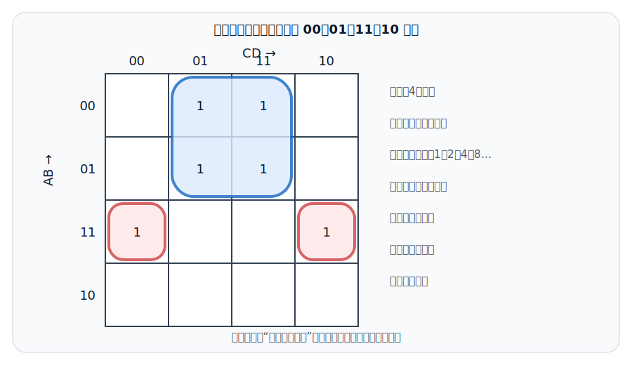
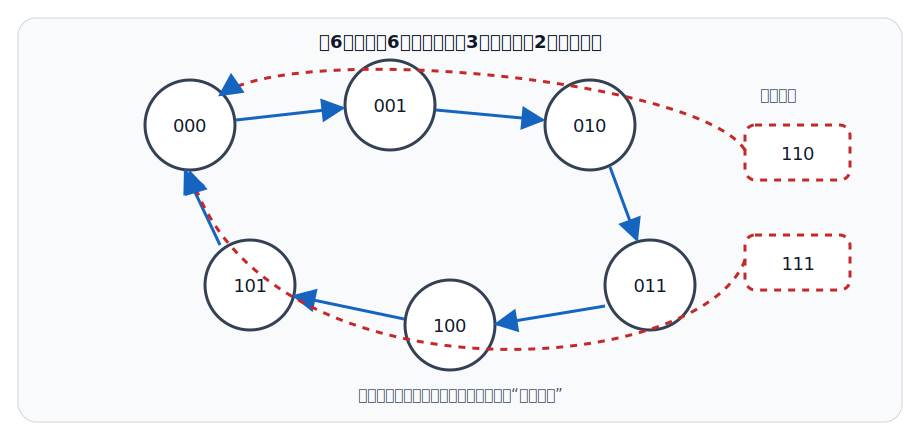

# 📚 数字电子技术

使用说明：🔴红色 = 期末必须掌握的逻辑规则、状态表和公式；🔵蓝色 = 分析与设计题标准步骤；⚫️黑色 = 器件条件、时序细节与陷阱。讲义按大学《数字电子技术基础》的典型期末结构组织，“RJ触发器”若出现在题目中，应结合选项判断它实际指RS还是JK触发器。

## 零基础预备：从电平到逻辑

考点0：0和1并不是固定的0 V和1 V

⚫️【逻辑电平】：数字电路把一段电压范围解释为逻辑0，把另一段范围解释为逻辑1；具体阈值由TTL、CMOS系列和电源电压决定。不能把所有“1”都理解为1伏。

⚫️【正逻辑】：高电平表示1、低电平表示0，是教材最常用约定；若采用负逻辑，含义相反。

🔴【位bit】：一位二进制只能表示0或1；n位共有 `2^n` 种组合。数字电路的核心工作是“表示、变换和保存这些状态”。

考点0.1：四种描述方式要能互相转换

🔴【逻辑功能的四种表示】：逻辑表达式、真值表、逻辑图和波形图。表达式便于代数运算，真值表穷举输入输出，逻辑图体现实现，波形图体现随时间变化。

🔵【零基础顺序】：先逐行看真值表 → 写最小项表达式 → 化简 → 画门电路。时序题则先找有效时钟边沿，再逐个边沿更新状态。

考点0.2：组合逻辑与时序逻辑

⚫️组合逻辑像“即时计算器”，输出只看现在输入；时序逻辑像“带记忆的机器”，输出还与过去保存下来的状态有关。

第一章：数制、编码与逻辑代数

考点1：数制转换

🔴【按权展开】：任意进制数的值等于各位数字乘以基数相应次幂后求和。

🔵【十进制转二进制】：整数部分除2取余、倒序排列；小数部分乘2取整、顺序排列。

🔴【二进制与八/十六进制】：从小数点向两边分组，三位二进制对应一位八进制，四位二进制对应一位十六进制。

考点2：原码、反码与补码

🔴【正数】：原码、反码、补码相同。

🔴【负数补码】：符号位不变，数值位按位取反再加1；补码减法可转化为补码加法。

🔴【n位补码范围】：`-2^(n-1) ～ 2^(n-1)-1`。

⚫️【坑点】：补码的零只有一种表示；原码存在正零和负零。

考点3：常用编码

🔴【8421 BCD码】：用四位二进制表示一位十进制数字0～9，`1010～1111` 为非法码。

🔴【格雷码】：相邻码字只有一位不同，可减少机械位置编码切换时的竞争错误。

🔴【奇偶校验】：增加一位校验位，可检测奇数个位错误，不能定位错误，也不能保证检测所有偶数个位错误。

考点4：基本逻辑与复合逻辑

🔴【与AND】：全1出1；【或OR】：有1出1；【非NOT】：输入取反；【异或XOR】：不同出1；【同或XNOR】：相同出1。

🔴【常用表达】：异或 `A⊕B = ĀB + AḂ`；同或 `A⊙B = AB + ĀḂ`。

🔴【功能完备】：仅用与非门NAND或仅用或非门NOR都能实现任意组合逻辑函数。

考点5：逻辑代数定律

🔴【德摩根定律】：`overline(A+B) = Ā·B̄`，`overline(AB) = Ā+B̄`。

🔴【吸收律】：`A+AB = A`，`A(A+B) = A`。

🔴【消去律】：`A+ĀB = A+B`，`A(Ā+B) = AB`。

⚫️【对偶规则】：交换“与/或”和“0/1”可得到对偶式，但变量及其反变量不交换。

第二章：逻辑函数化简

考点6：最小项、最大项与标准形式

🔴【最小项】：每个变量恰出现一次的乘积项；在唯一一组输入下取1。`Σm(...)` 表示最小项之和。

🔴【最大项】：每个变量恰出现一次的和项；在唯一一组输入下取0。`ΠM(...)` 表示最大项之积。

⚫️【编号】：按变量二进制取值确定，通常最高位变量写在最左；考试以题目规定变量顺序为准。

考点7：卡诺图化简

🔴【排列规则】：行列按格雷码顺序排列，如 `00, 01, 11, 10`，相邻格只有一位不同。

🔵【化简步骤】：填1 → 按 `1、2、4、8…` 个格尽量圈大 → 所有1至少覆盖一次 → 可重复利用 → 写出圈内保持不变的变量。

🔴【相邻关系】：左右边界相邻、上下边界相邻，四角也相邻；对角线不相邻。

🔴【无关项X】：可按0或1使用，以得到更简表达式；没有必要时可不圈。

第三章：组合逻辑电路

考点8：组合逻辑分析与设计

🔴【特征】：任一时刻输出只由该时刻输入决定，不具有记忆功能。

🔵【分析步骤】：由电路逐级写表达式 → 化简 → 列真值表 → 说明逻辑功能。

🔵【设计步骤】：明确输入输出含义 → 列真值表 → 写逻辑函数 → 化简 → 选门电路或集成器件实现。

考点9：加法器与比较器

🔴【半加器】：和 `S = A⊕B`，进位 `C = AB`，不考虑低位进位。

🔴【全加器】：`S = A⊕B⊕Cin`，`Cout = AB + (A⊕B)Cin`。

🔴【数值比较器】：判断 `A>B、A=B、A<B`，三个输出在正常条件下互斥。

考点10：编码器与译码器

🔴【编码器】：把多个输入状态转换为较少位的二进制代码；优先编码器在多个输入同时有效时只编码最高优先级输入。

🔴【译码器】：把n位输入译成最多 `2^n` 个互斥输出，可用于地址译码和实现逻辑函数。

⚫️【使能端】：使能状态可能是高有效或低有效，必须看引脚符号和题设，不能一律按1有效。

考点11：数据选择器与数据分配器

🔴【数据选择器MUX】：选择地址决定多路输入中的哪一路送到单一输出，`2^n` 选1通常需要n位选择信号。

🔴【数据分配器DEMUX】：把一路数据按地址送往多个输出中的一路。

🔵【用MUX实现函数】：把部分变量接选择端，根据真值表将数据端接0、1、变量或反变量。

考点12：竞争与冒险

🔴【竞争】：同一输入信号经不同路径到达某点的时间不同；【冒险】：竞争导致输出出现不应有的瞬时尖峰。

🔵【常用消除方法】：增加冗余项、选通脉冲避开过渡期、加滤波电容或采用同步设计。

专题1：OC门、三态门与总线

🔴【OC门/开集电极门】：输出晶体管集电极开路，使用时通常需要外接上拉电阻；多个OC输出可并联实现线与功能。

🔴【三态门】：除0和1外还有高阻态 `Z`；高阻态相当于暂时与总线断开，使多个设备可分时共享同一总线。

⚫️【坑点】：普通推挽输出门不能直接并联，否则不同输出电平可能造成大电流冲突；能否并联取决于输出结构。

第四章：锁存器与触发器

考点13：锁存器和触发器的区别

🔴【锁存器】：电平敏感，在使能有效期间输入变化可能影响输出。

🔴【触发器】：通常在时钟边沿到来时采样输入，具有记忆一位二进制状态的能力。

⚫️【坑点】：电路符号上的小圆圈表示低有效，三角符号常表示边沿触发；三角加小圆圈通常表示下降沿触发。

考点14：SR锁存器/触发器

🔴【高有效NOR型SR】：`S=0,R=0` 保持；`S=1,R=0` 置1；`S=0,R=1` 置0；`S=1,R=1` 为禁用/不确定状态。

🔴【低有效NAND型S̄R̄】：`S̄=1,R̄=1` 保持；`0,1` 置1；`1,0` 置0；`0,0` 禁用。

⚫️【坑点】：RS禁用组合取决于输入是高有效还是低有效，不能脱离电路类型背一个固定组合。

考点15：JK、D与T触发器

| 触发器 | 输入条件 | 下一状态Q(n+1) |
|---|---|---|
| JK | J=0,K=0 | 保持 |
| JK | J=0,K=1 | 置0 |
| JK | J=1,K=0 | 置1 |
| JK | J=1,K=1 | 翻转 |
| D | 任意D | `Q(n+1)=D` |
| T | T=0 | 保持 |
| T | T=1 | 翻转 |

🔴【特性方程】：JK为 `Q(n+1)=JQ̄(n)+K̄Q(n)`；D为 `Q(n+1)=D`；T为 `Q(n+1)=T⊕Q(n)`。

🔴【触发器转换】：先写目标触发器激励需求，再与现有触发器特性方程比较，得到输入端组合逻辑。

考点16：时序参数

🔴【建立时间】：有效时钟边沿前输入必须稳定的最短时间；【保持时间】：有效边沿后输入仍须稳定的最短时间。

🔴【传播延迟】：时钟或输入变化到输出稳定之间的时间。违反建立/保持时间可能产生亚稳态。

第五章：时序逻辑电路

考点17：同步时序电路分析

🔴【特征】：输出不仅与当前输入有关，还与原状态有关；状态由触发器保存。

🔵【分析步骤】：写各触发器激励方程 → 代入特性方程求次态 → 写输出方程 → 列状态表/画状态图 → 判断逻辑功能与有效循环。

考点18：寄存器与移位寄存器

🔴【寄存器】：暂存多位二进制数据；n位寄存器通常由n个触发器组成。

🔴【移位寄存器】：每个时钟使数据左移或右移一位，可完成串并转换、延时和序列产生。

考点19：计数器

🔴【模N计数器】：共有N个有效状态；需要触发器数量 `n ≥ ceil(log2N)`。

🔴【同步计数器】：所有触发器受同一时钟控制，速度较快；异步计数器逐级触发，结构简单但累计延迟较大。

🔵【任意进制】：可利用清零、置数或状态反馈截取所需N个状态；必须检查是否能从无效状态回到有效循环，即自启动能力。

考点20：状态机设计

🔵【标准流程】：文字功能 → 原始状态图/表 → 状态化简 → 状态编码 → 选触发器 → 求激励和输出函数 → 画逻辑图 → 检查无效状态。

🔴【Mealy与Moore】：Mealy输出与当前状态和输入有关；Moore输出只与当前状态有关。

第六章：脉冲电路与数模/模数转换

考点21：施密特、单稳态与多谐振荡器

🔴【施密特触发器】：具有两个不同阈值和回差特性，适合把缓慢或带噪信号整形成矩形波。

🔴【单稳态】：一个稳定状态、一个暂稳状态，受触发后输出固定宽度脉冲。

🔴【多谐振荡器】：没有稳定状态，可自激产生连续矩形脉冲。

考点22：555定时器

🔴【典型内部阈值】：比较基准通常为 `1/3VCC` 和 `2/3VCC`；可构成单稳态、多谐振荡器和施密特触发器。

⚫️【考试策略】：若给出具体电路，先判断充放电路径和电容电压跨越的两个阈值，再计算高、低电平持续时间。

考点23：D/A转换

🔴【DAC】：把数字量转换为与其数值成比例的模拟电压或电流；常见权电阻网络和倒T形R-2R网络。

🔴【分辨率】：n位DAC有 `2^n` 个代码；1 LSB所代表的模拟变化取决于满量程的定义，答题时应写清采用 `FS/2^n` 还是 `FS/(2^n-1)`。

考点24：A/D转换

🔴【基本过程】：采样 → 保持 → 量化 → 编码。

🔴【量化误差】：理想均匀量化器通常不超过 `±1/2 LSB`。

| ADC类型 | 速度 | 特点 |
|---|---|---|
| 并行比较型 | 最快 | 比较器数量多、成本高 |
| 逐次逼近型 | 较快 | 速度与精度折中，应用广 |
| 双积分型 | 较慢 | 抗干扰、精度较好，常用于数字仪表 |

专题2：半导体存储器与可编程逻辑

🔴【容量表示】：`2^n × m` 表示有 `2^n` 个字、每字m位，通常需要n根地址线和m根数据线。

🔵【例】：`8K×8` 存储器有8192个字，需要 `log₂8192 = 13` 根地址线，数据线8根，总容量为64 Kbit，即8 KB。

🔴【RAM】：可读写，通常易失；【ROM】：正常使用中以读为主，断电后信息通常保留。Flash可电擦写，属于非易失存储。

🔴【PLD】：用可编程逻辑资源实现组合或时序逻辑；FPGA通常含可编程逻辑块、互连和I/O资源。

第七章：典型题

考点25：JK状态例题

🔵【题目】：某上升沿JK触发器当前 `Q=0`，时钟有效边沿到来时 `J=K=1`，求下一状态。

🔵【解】：JK在 `J=K=1` 时翻转，因此 `Q(n+1)=1`。

考点26：计数器位数例题

🔵【题目】：设计模10计数器至少需要多少个触发器？

🔵【解】：`2³=8<10`，`2⁴=16≥10`，至少需要4个触发器，并有6个无效状态需考虑自启动。

考点27：全加器例题

🔵【题目】：`A=1,B=1,Cin=0`，求和与进位。

🔵【解】：`S=1⊕1⊕0=0`，`Cout=1`。

第八章：期末自测与答案

考点28：自测题

1. 四位二进制对应几位十六进制？
2. 异或门在两个输入怎样时输出1？
3. 组合逻辑电路是否具有记忆功能？
4. 高有效NOR型SR锁存器的禁用输入是什么？
5. JK触发器 `J=K=1` 时执行什么操作？
6. D触发器的下一状态是什么？
7. 模12计数器至少需要几个触发器？
8. 逐次逼近ADC和双积分ADC哪个通常更快？

考点29：自测答案

🔵1. 一位。2. 两输入不同。3. 不具有。4. `S=R=1`。5. 翻转。6. `Q(n+1)=D`。7. 4个。8. 逐次逼近型。

第九章：复习优先级与取舍

考点30：复习优先级

🔴【A级必会】：基本门、德摩根、真值表、组合/时序区别、RS/JK/D/T状态、计数器位数。

🔵【B级得分】：卡诺图、组合电路分析、OC/三态门、加法器/译码器/MUX、同步时序分析、寄存器、存储器容量与ADC/DAC。

⚫️【C级选学】：复杂状态机设计、竞争冒险证明、555精确充放电推导和HDL。先把状态表与基本计算拿稳。

第十章：公开试题提炼训练

考点31：网络题型分析

⚫️公开大学期末试卷显示，数电通常采用“基础填空/选择＋组合逻辑分析与设计＋触发器波形＋时序电路状态分析＋计数器/555综合”的结构。真正的大分题要求写过程：表达式、真值表、状态方程、状态图和自启动不能互相替代。

| 题型 | 高频任务 | 必写过程 |
|---|---|---|
| 逻辑基础 | 数制、逻辑门、OC/三态、存储器 | 写清有效电平和单位 |
| 化简 | 代数法、卡诺图 | 圈组或写使用的定律 |
| 组合分析 | 门电路、MUX、译码器 | 表达式→真值表→功能 |
| 组合设计 | 表决、比较、编码 | 定义变量→真值表→化简→实现 |
| 波形题 | D/JK/T触发器 | 标有效沿，逐沿更新 |
| 时序分析 | 计数器、状态机 | 驱动方程→状态方程→状态表/图 |

考点32：基础层原创练习

1. 把十进制45转换为二进制和十六进制。

2. 用德摩根定律展开 `overline(A+BC)`。

3. 一个16选1数据选择器需要多少根选择线？

4. 为什么普通推挽输出门不能随意并联，而OC门可以在外接上拉电阻后并联？

5. 高有效NOR型SR锁存器的保持、置1、置0和禁用组合分别是什么？

6. JK触发器当前 `Q=1`，有效时钟沿到来时 `J=K=1`，下一状态是什么？

考点33：基础层答案

🔵1. `45=32+8+4+1`，故二进制为 `101101₂`；按四位分组 `0010 1101`，十六进制为 `2D₁₆`。

🔵2. `overline(A+BC)=Ā·overline(BC)=Ā(B̄+C̄)`。

🔵3. 因 `2⁴=16`，需要4根选择线。

🔵4. 推挽门若一个输出高、另一个输出低，会形成低阻大电流冲突；OC输出的上拉统一由电阻完成，多个晶体管只负责拉低，可实现线与。

🔵5. `00`保持、`10`置1、`01`置0、`11`禁用。若是低有效NAND型，组合必须重新判断。

🔵6. JK在 `11` 时翻转，所以从1变为0。

考点34：分析与设计层原创练习

1. 化简逻辑函数 `F=A+ĀB`。

2. 三个独立温度传感器A、B、C中至少两个报警时，系统输出F=1。列真值表的报警行并写最简与或式。

3. 一个上升沿D触发器初态 `Q=0`，连续四个有效边沿到来前的D依次为 `1、0、1、1`。写出每个边沿后的Q。

4. 设计模24计数器至少需要几个触发器？有多少个二进制组合未使用？

5. `16K×8` ROM需要多少根地址线和数据线？总容量是多少bit和Byte？

6. 8位均匀ADC参考范围为 `0～5.12 V`，若按 `FS/2^n` 定义1 LSB，求分辨率和理想最大量化误差。

考点35：详细解析

🔵1. 用吸收/消去律：`A+ĀB=(A+Ā)(A+B)=A+B`。

🔵2. 报警行是 `011、101、110、111`；最简式 `F=AB+AC+BC`。设计题应先说明1表示报警，再列真值表，不能直接猜公式。

🔵3. D触发器每个上升沿执行 `Q⁺=D`，所以状态依次为 `1、0、1、1`；两个边沿之间不随D变化。

🔵4. `2⁴=16<24`、`2⁵=32≥24`，至少5个触发器；共有 `32-24=8` 个未使用状态，需检查自启动。

🔵5. `16K=16384=2¹⁴`，地址线14根、数据线8根；总容量 `16K×8=128 Kbit=16 KB`。

🔵6. `1 LSB=5.12/256=0.02 V=20 mV`；理想最大量化误差为 `±10 mV`。

考点36：时序综合训练

1. 一个三位模6加法计数器按 `000→001→010→011→100→101→000` 循环。写出有效状态数量、触发器数量和无效状态；说明“能自启动”是什么意思。

2. 施密特触发器、单稳态触发器、多谐振荡器分别有几个稳定状态，各适合完成什么功能？

3. 某触发器时序题中，D在时钟上升沿附近恰好变化。能否只凭理想特性方程确定Q？为什么？

考点37：时序综合答案

🔵1. 有效状态6个，触发器3个，无效状态为 `110、111`。能自启动指电路意外进入无效状态后，仍能在有限个时钟内自动返回有效循环，而不是锁死在无效环中。

🔵2. 施密特有两个稳定状态，用于带回差整形；单稳态有一个稳定状态，用于产生固定宽度脉冲；多谐振荡器没有稳定状态，用于连续产生矩形波。

🔵3. 不能。真实触发器要求建立时间和保持时间，若输入在有效沿附近变化，可能违反时序约束并产生亚稳态；理想题若未说明，通常假设输入避开边沿。

第十一章：公开课程依据

考点38：课程框架来源

⚫️【华中科技大学《数字电子技术基础》】：https://www.icourse163.org/course/detail.htm?cid=1001909001

⚫️【北京交通大学《数字电子技术基础》】：https://www.icourse163.org/course/NJTU-1002105006

⚫️【口径提示】：触发器有效电平、异步置位/清零和芯片引脚题应以题图与指定教材为准。

⚫️【中南大学公开数字电子技术期末试卷】：https://dgdz.csu.edu.cn/sitefiles/377B607CD3E9D731F24247D78BAE939F/145D0FA8BD8FB40DA48A7095A1258A70.pdf
