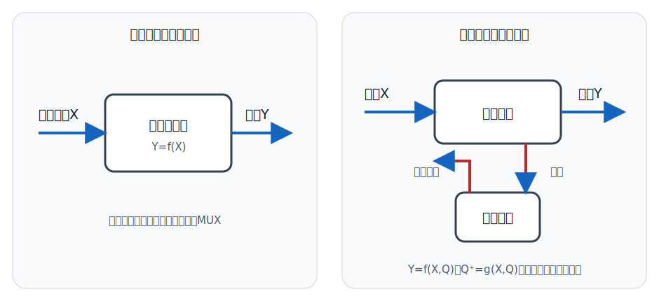
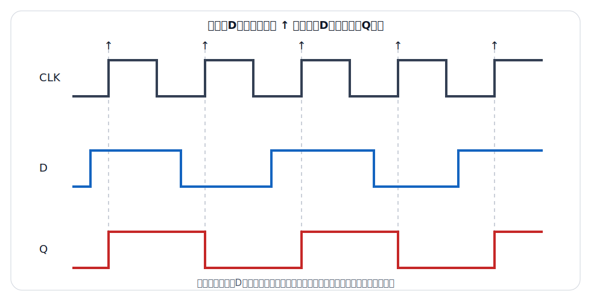
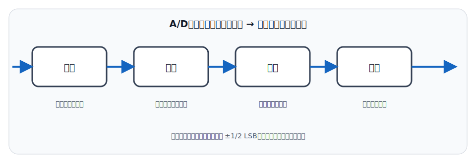

# 数字电子技术

## 一、数字信号与数制
<!-- exam: A | 单选、判断、填空、计算 -->

### 1. 数字信号

数字信号的逻辑取值是离散的，二进制系统只区分逻辑0和逻辑1。承载数字信息的实际电压或电流波形仍是连续的物理量，只要落在规定阈值范围内就被判为相应逻辑状态；因此逻辑0、1不固定等于0 V、1 V。

数字电路的主要优点包括抗干扰能力较强、便于存储和处理、易于集成、可靠性较高。模拟量要进入数字系统，通常需要经过采样、量化和编码。

### 2. 二进制与十六进制

- 二进制只有0、1，逢二进一。
- 十六进制使用0～9和A～F，A～F分别表示10～15。
- 一位十六进制恰好对应四位二进制。

例：十进制13写成二进制是 `1101`，写成十六进制是 `D`。二进制转十六进制可从低位起每四位分为一组，不足四位时在最高位一侧补0。

十进制整数转换为其他进制时，可反复“除以基数取余”，再把余数倒序排列；其他进制转换为十进制时，按各位权值展开求和。例如二进制 `10110` 对应 `1×2⁴+0×2³+1×2²+1×2¹+0=22`。八进制一位对应三位二进制，十六进制一位对应四位二进制，因此这两类转换通常先按位分组最方便。

### 3. 常用码制与检错

- 8421 BCD码：用四位二进制代码分别表示一位十进制数字，各位权值为8、4、2、1。十进制0～9对应 `0000`～`1001`，`1010`～`1111`不是合法的单个十进制数字8421码。BCD码是“逐个十进制数位编码”，不等同于把整个十进制数直接转换成纯二进制。
- ASCII码：用于表示英文字母、数字、标点和控制字符的字符编码。标准ASCII是7位编码，实际存储和传输时常占用一个字节；字符 `'0'` 的编码不等于数值0。
- 奇偶校验：在数据后增加一个校验位，使含校验位的1的总数保持为偶数或奇数。它能发现任意奇数个比特错误，但不能可靠发现偶数个比特同时出错，也不能指出或纠正错误位置。

## 二、基本逻辑门
<!-- exam: A | 单选、判断、多选、状态判断 -->

### 1. 与、或、非

- 与门（AND）：所有输入都为1，输出才为1，可理解为“条件同时满足”。
- 或门（OR）：至少一个输入为1，输出就为1，可理解为“任一条件满足”。
- 非门（NOT）：输出与输入相反。

### 2. 与非、或非、异或、同或

- 与非门：先与后非，只有所有输入为1时输出0。
- 或非门：先或后非，只有所有输入为0时输出1。
- 异或门（XOR）：两个输入不同时输出1，可用于不等比较或奇偶校验。
- 同或门（XNOR）：两个输入相同时输出1，可用于相等比较。

与非门和或非门都称通用门，通过适当连接可以实现各种基本逻辑函数。

### 3. 有效电平与常见器件系列

正逻辑约定高电平表示1、低电平表示0；若采用负逻辑，含义相反。逻辑符号输入或输出端的小圆圈通常表示反相或低有效，名称上方的横线也常表示低有效。清零端、置位端和使能端的功能必须结合高有效或低有效标志判断。

TTL和CMOS是常见数字集成电路系列。传统TTL速度较快、输入端处理有特定规则；CMOS静态功耗低、输入阻抗高、集成度高，但未使用输入端不能随意悬空。不同器件系列的电源范围和高、低电平阈值不同，连接前应确认电平兼容，不能把某一芯片的参数推广到全部器件。

数字器件还常用传播延迟、扇入、扇出、噪声容限和功耗描述性能。传播延迟表示输入变化到输出稳定所需时间；扇入是门的输入端数量；扇出表示一个输出能够可靠驱动的同类输入数量。噪声容限反映电平在仍可被正确判定前允许受到的干扰范围。速度、功耗和驱动能力之间往往需要权衡。

### 4. 高阻态

三态门除逻辑0和1外还可输出高阻态。高阻态相当于输出端暂时与外部断开，便于多个器件分时共享总线。高阻态不是第三种逻辑数值，也不等于输出电压必然为0。

### 5. 真值表和逻辑表达式

真值表列出所有输入组合及对应输出。`n`个二值输入共有 `2^n` 种组合。逻辑表达式、真值表、逻辑图和波形图是描述逻辑功能的常用方式。

逻辑功能可通过逐种输入代入并列真值表确定，不能只凭电路外形推测。

## 三、逻辑代数基础
<!-- exam: A | 单选、判断、填空、计算 -->

常用基本规律：

- `A·1=A`，`A+0=A`
- `A·0=0`，`A+1=1`
- `A·A=A`，`A+A=A`
- `A·A̅=0`，`A+A̅=1`
- 双重否定：`(A̅)̅=A`

德摩根定律：

- 和的非等于各项取非后的积：`(A+B)̅=A̅·B̅`
- 积的非等于各项取非后的和：`(A·B)̅=A̅+B̅`

使用德摩根定律时，总非号去掉后，与、或运算互换，并对每个变量分别取反；只换运算符而漏掉变量取反会得到错误结果。

**通俗理解：** 逻辑代数不是普通算术，而是在处理条件是否成立。“与”像所有门禁条件都满足才放行，“或”像任一条件满足即可放行，“非”把成立与不成立互换。德摩根定律表达的是：“并非两项都成立”等价于“至少有一项不成立”。类比帮助理解条件关系，但逻辑符号 `+` 表示或、`·` 表示与，不能按普通加法和乘法计算，例如 `1+1` 在布尔代数中仍为1。

逻辑函数常写成“最小项之和”或“最大项之积”。最小项包含全部变量，每个变量以原变量或反变量出现一次，并且只在一种输入组合下取1；最大项也包含全部变量，并且只在一种输入组合下取0。真值表中输出为1的行可直接写成相应最小项的逻辑和，这为卡诺图化简和组合电路设计提供统一起点。

### 卡诺图化简

卡诺图把真值表按格雷码顺序排列，使相邻格只有一个变量不同。化简“与或式”时，把值为1的相邻格按 `1、2、4、8…` 个一组圈出：每组越大，消去的变量越多；上下边和左右边也彼此相邻，同一个1可以被不同分组重复使用。

无关项可按需要当作0或1，以形成更大的分组，但不能强制使用。例：二变量函数 `F(A,B)=Σm(1,2,3)` 只有 `A=B=0` 时为0，化简后为 `F=A+B`。卡诺图适合变量较少的逻辑函数，变量很多时通常采用算法或综合工具。

## 四、组合逻辑电路
<!-- exam: A | 单选、判断、多选、计算、场景题 -->

组合逻辑电路的输出只取决于当前输入，不保存过去状态。常见器件包括：

**通俗理解：** 组合逻辑像普通计算器，按下当前数字和运算符便由当前输入决定结果；时序逻辑更像带记录的自动售货机，同样按一次按钮，输出还取决于此前是否已经投币。准确地说，组合逻辑可写成当前输入的函数，时序逻辑还包含由触发器等存储单元保存的状态；实际组合门仍有传播延迟，所以“只取决于当前输入”描述的是稳定后的逻辑功能，不表示输出在物理上瞬间变化。

- 编码器：把有效输入转换为代码。
- 译码器：把输入代码翻译成对应输出。
- 数据选择器（MUX）：从多路输入中选择一路送到输出。
- 数据分配器：把一路输入送到指定输出。
- 加法器：完成二进制加法。
- 数值比较器：比较两个二进制数的大小或是否相等。

组合逻辑设计的一般过程是：明确输入、输出及有效电平 → 根据功能列真值表 → 写出并化简逻辑函数 → 选择门电路或功能器件实现 → 检查所有输入组合。分析已有电路时顺序相反：从逻辑图写表达式，必要时化简，再列真值表并解释功能。

译码器的每个输出通常对应一种输入代码，配合或门可以实现“最小项之和”形式的逻辑函数；数据选择器也能把变量接到选择端、把0、1或剩余变量接到数据端来实现逻辑函数。使用带使能端的器件时，必须先满足使能条件，否则正常功能输出不会出现。

半加器只考虑两个本位输入，输出“和”与“进位”；全加器还考虑来自低位的进位输入。

半加器有 `S=A⊕B、C=AB`；全加器有 `S=A⊕B⊕Cin`、`Cout=AB+(A⊕B)Cin`。多位加法器由多个全加器级联，低位进位会影响高位结果。

组合电路可能因不同信号路径的门延迟不一致而出现短暂错误脉冲，称竞争冒险。增加冗余项、合理选通或使输出在信号稳定后再被采样，可以降低毛刺的影响。

竞争描述多个输入或中间信号到达先后不一致，冒险描述这种差异造成输出短暂错误。组合电路的静态真值表正确，并不保证转换瞬间没有毛刺；若输出直接驱动异步控制端，短脉冲可能被后级误认为有效事件，因此工程上常在时钟边沿统一采样稳定结果。

## 五、触发器与时序逻辑
<!-- exam: A | 单选、判断、多选、计算、状态判断、场景题 -->

### 1. 时序逻辑的特点

时序逻辑电路的输出不仅取决于当前输入，还与原有状态有关，具有记忆功能。触发器是时序电路的基本存储单元，能够保存一位二进制信息。

RS、JK、D、T是常见触发器，它们用不同输入关系规定下一状态。

锁存器通常在使能电平有效期间对输入敏感，属于电平敏感器件；边沿触发器只在时钟有效边沿采样输入。两者都能保存状态，但时序约束和波形分析方法不同。同步数字系统通常利用统一时钟把组合逻辑与触发器连接起来，使状态只在规定时刻更新。

**通俗理解：** 边沿触发器像只在快门按下的一瞬间拍照：有效时钟边沿到来时读取输入，随后把这一位信息保持到下一次有效边沿；锁存器则像使能期间一直开着的窗口，输入变化可能继续传到输出。这个类比的边界是输入不能恰好在“拍照”附近任意变化，实际器件必须满足建立时间和保持时间，否则可能进入亚稳态，输出暂时不能可靠判为0或1。

### 2. RS触发器

以常见高有效RS触发器为例：

- `S=1，R=0`：置1。
- `S=0，R=1`：置0。
- `S=0，R=0`：保持。
- `S=1，R=1`：禁用或不确定状态。

低有效RS输入的有效状态与上述高有效关系相反，输入端的小圆圈或名称上方横线表示低有效。

### 3. JK触发器

- `J=0，K=0`：保持。
- `J=0，K=1`：置0。
- `J=1，K=0`：置1。
- `J=1，K=1`：翻转。

JK触发器克服了基本RS触发器的禁用状态，因此功能更完善。

### 4. D和T触发器

- D触发器：在有效时钟边沿把输入D送入并保存，`Q下一状态=D`。
- T触发器：`T=0`保持，`T=1`翻转，常用于计数和分频。

边沿触发器只在规定的有效时钟边沿采样输入并更新状态；两个有效边沿之间的输入变化不会立即改变其状态。

### 5. 状态方程、状态表和状态图

状态方程用代数式表示下一状态 `Q+` 与当前状态、输入之间的关系：

- RS触发器：`Q+=S+R̅Q`，约束为 `SR=0`。
- JK触发器：`Q+=JQ̅+K̅Q`。
- D触发器：`Q+=D`。
- T触发器：`Q+=T⊕Q`。

状态表列出“当前状态、输入、下一状态、输出”；状态图用节点表示状态、带条件的箭头表示状态转移。两者是同一时序逻辑功能的不同表示，可相互转换。

**小例子：** 一个T触发器当前 `Q=0`，在有效时钟边沿到来前 `T=1`，由 `Q+=T⊕Q` 得下一状态为1；再经历一次 `T=1` 的有效边沿，状态又回到0。它每两个输入脉冲完成一个状态周期，因此可用于二分频。

### 6. 同步时序分析

同步时序电路中的各触发器由同一时钟控制。分析时由组合逻辑得到各触发器激励，再利用特性方程求下一状态，最后确定输出并画出状态转移。输出只由状态决定的是Moore型，输出同时由状态和当前输入决定的是Mealy型。

异步置位、复位端可不等待时钟直接改变状态，不能与同步数据输入混为一谈。时钟边沿附近还要满足建立时间和保持时间，否则触发器可能进入亚稳态。

只根据“此刻输入”输出结果，如门禁同时满足“刷卡有效且未报警”才开门，属于组合逻辑；需要保存按钮状态、累计脉冲或暂存数据时，需要触发器或其他时序逻辑。D触发器适合在时钟沿保存一位状态，T或JK触发器的翻转功能常用于计数和分频。

## 六、寄存器、计数器与半导体存储器
<!-- exam: A | 单选、判断、多选、计算、状态判断、场景题 -->

### 1. 寄存器与移位寄存器

寄存器由多个触发器组成，用于暂存一组二进制数据。并行寄存器在同一时钟沿同时装入多位数据；移位寄存器使数据按时钟逐位移动，可完成串入并出、并入串出、延时和序列产生。

### 2. 计数器分类与时序

计数器对输入脉冲进行状态计数。同步计数器的各触发器由同一时钟驱动，状态近似同时更新；异步计数器由前一级输出触发后一级，结构简单但传播延迟逐级累积。按计数方向还可分加法、减法和可逆计数器。

模 `N` 计数器有 `N` 个有效状态，所需触发器数为满足 `2^n≥N` 的最小整数 `n`。例如模10计数器至少需要4个触发器，剩余6种编码属于未用状态。

### 3. 同步计数器设计

同步计数器先规定有效状态循环并编码，再建立状态表；根据所选触发器的激励规律求各输入逻辑，最后验证未用状态能否回到有效循环。例：模4二进制加法计数器的状态按 `00→01→10→11→00` 循环，两个触发器即可表示全部状态。

未用状态若进入后无法回到有效循环，电路可能“锁死”。通过设计下一状态使未用状态自动转入有效状态，可形成自启动计数器。

### 4. 半导体存储器

- RAM可随机读写，通常是易失性存储器。SRAM用双稳态单元保存数据，速度快且不需刷新；DRAM用电容电荷保存数据，集成度高但需要周期刷新。
- ROM正常使用时以读取为主，断电后数据可保留。掩膜ROM内容固定，PROM可一次编程，EPROM或EEPROM可按相应方式擦除后重写。

存储器容量常写成“字数×字长”。例如 `1K×8` 表示1024个存储单元，每个单元8 bit，总容量为8192 bit。

若存储器有 `n` 根地址线，最多可选择 `2^n` 个地址；有 `m` 根双向数据线时，每个地址通常读写 `m` bit。多片存储器扩展字长时，各芯片共用地址和控制信号、并行提供不同数据位；扩展字数时，需要增加片选译码，使同一时刻只有目标芯片响应。

## 七、脉冲电路与数模、模数转换
<!-- exam: B | 单选、判断、多选、计算、状态判断、场景题 -->

### 1. 脉冲参数与施密特触发

矩形脉冲常用幅度、周期、频率、脉宽和占空比描述，`f=1/T`，`D=tH/T×100%`。施密特触发器具有上、下两个翻转阈值和回差，可把缓慢或带噪声的输入整形成稳定数字电平。

### 2. 555定时器

555定时器可构成三类典型电路：单稳态只有一个稳定状态，受触发后输出一定宽度脉冲再返回；无稳态没有稳定状态，可连续产生矩形脉冲；施密特触发利用两个阈值完成整形和抗干扰。三者分别常用于定时或延时、时钟产生、波形整形。

### 3. ADC与DAC

ADC把模拟量转换为数字量，基本过程包括采样保持、量化和编码；DAC把数字量转换为模拟量。理想 `n` 位ADC或DAC有 `2^n` 个量化等级，近似分辨率为 `满量程/2^n`。

常见DAC可用权电阻网络或R-2R梯形网络把各数字位的权值转换成模拟量；常见ADC结构包括并行比较、逐次逼近和双积分等。并行比较速度快但比较器数量多，逐次逼近在速度与复杂度之间较均衡，双积分速度较慢但抗工频干扰能力较好。结构不同不会改变“采样—量化—编码”的基本含义。

例如0～3.3 V的12位ADC最低有效位约为 `3.3/4096≈0.806 mV`。分辨率表示可区分的最小理想步长，不等于绝对精度；实际误差还包括量化误差、偏置、增益误差和噪声。

转换时间或转换速率决定系统能多快得到新数据；输入信号变化过快而采样率不足会产生混叠。位数提高通常改善理想分辨率，但若参考电压不稳定、前端噪声过大或布局接地不合理，实际有效位数仍可能明显低于标称位数。

## 八、考前速记与典型判断
<!-- exam: A | 单选、判断、计算、状态判断 -->

- 与非门、或非门都是通用门；异或门在输入不同时输出1，同或门在输入相同时输出1。
- BCD码用4位二进制表示一位十进制数，合法组合只有 `0000` 到 `1001`；不能把所有4位二进制数都当作合法BCD码。
- RS触发器的禁用输入是 `R=S=1`；JK触发器在 `J=K=1` 时翻转；D触发器下一状态等于D；T触发器在 `T=1` 时翻转。
- 组合逻辑的输出只由当前输入决定；时序逻辑还与存储的当前状态和时钟有关。
- 模 `N` 计数器至少需要满足 `2^n≥N` 的 `n` 个触发器。未用状态若不能回到有效状态循环，计数器可能无法正常工作。

**一步计算：** 0～5 V 的8位ADC，理想最小量化步长约为 `5/2^8=19.5 mV`。这是分辨率，不等于包含偏置、噪声后的实际绝对精度。
