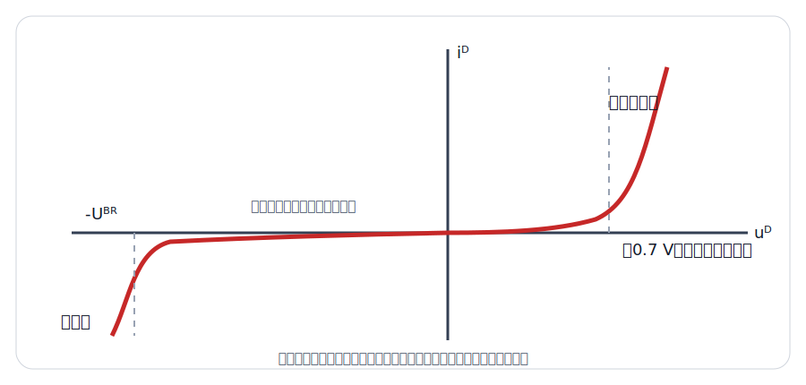
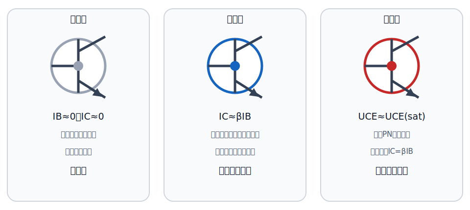
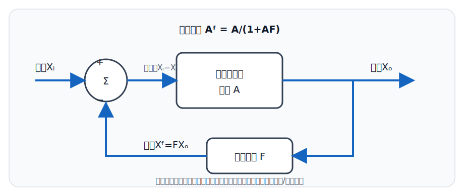

# 模拟电子技术

## 一、模拟信号与半导体基础
<!-- exam: A | 单选、判断、填空 -->

### 1. 模拟信号和数字信号

模拟信号的幅度随时间连续变化，如麦克风输出的声音电压；数字信号通常用有限个离散电平表示信息，如逻辑0和1。

放大的本质是利用较小输入信号控制较大的输出变化。放大器不会凭空产生能量，输出能量来自直流电源。

### 2. 本征半导体与杂质半导体

纯净半导体称本征半导体。掺入适量杂质可形成：

- N型半导体：多数载流子是自由电子。
- P型半导体：多数载流子是空穴。

P型不是“带正电”，N型也不是“带负电”，两者整体仍保持电中性。

### 3. PN结

P型和N型半导体结合形成PN结。PN结具有单向导电性：正向偏置时容易导通，反向偏置时通常截止；反向电压超过一定限度可能击穿。

**通俗理解：** PN结可先近似想成带门槛的单向门：正向电压削弱耗尽层形成的势垒，载流子较容易通过；反向电压加宽耗尽层，通常只剩很小的反向电流。这个类比不能把PN结理解成理想机械开关，实际正向电流随电压连续且近似指数变化，也存在反向漏电、结电容和击穿现象。

温度升高时，半导体器件参数会发生明显变化，因此实际电路要考虑温度稳定性。

## 二、二极管及其应用
<!-- exam: A | 单选、判断、计算、状态判断、场景题 -->

### 1. 二极管的基本特性

二极管由一个PN结构成，有阳极和阴极。判断是否导通时先认清两端，再比较阳极与阴极电位。

硅二极管正向导通压降常近似取0.7 V，锗管常近似取0.2～0.3 V；采用理想二极管模型时，导通压降按0处理。

### 2. 常见二极管

- 整流二极管：把交流变成脉动直流。
- 稳压二极管：工作在反向击穿区，在规定电流范围内保持电压较稳定。
- 发光二极管（LED）：正向导通时发光，需要限流。
- 光电二极管：把光信号转换为电信号，常在反向偏置下工作。

普通二极管反向击穿通常应避免；稳压二极管则利用可控反向击穿工作，但必须限制电流。

判断工作状态必须先明确器件模型和极性：理想二极管正偏时按导通短路近似；硅二极管常在正向压差达到约 `0.7 V` 后按导通处理。实际器件的管压降和电流有关，不能在所有场景中固定为0或0.7 V。

最简单的限流电路中，电源 `U`、电阻 `R` 与二极管串联，导通电流可近似为 `I=(U-UD)/R`。例如 `U=5 V、R=1 kΩ、UD=0.7 V`，则 `I≈4.3 mA`。若计算得到负电流，应重新检查二极管是否实际处于导通状态。

**例题：** 直流串联限流：`U=10V`，限流电阻 `R=2kΩ`，硅二极管导通压降按 `0.7V`。  
导通电流 `I=(10-0.7)/2000≈4.65mA`。  
如果放大级输入偏置电流需求是 `8mA`，该支路不够，需要减小电阻或提高供电，再按需求决定是否加并联限流保护。先算数、再判断是否满足偏置电流，避免盲目选型。

### 3. 整流、滤波与稳压

直流稳压电源常包含变压、整流、滤波和稳压四个环节：

1. 变压：得到所需交流电压并实现必要隔离。
2. 整流：利用二极管单向导电性获得脉动直流。
3. 滤波：减小脉动成分，使电压较平滑。
4. 稳压：当输入或负载变化时保持输出电压相对稳定。

半波整流每周期主要利用一个半周；全波或桥式整流利用两个半周，输出脉动频率更高，滤波更容易。

## 三、三极管和基本放大器
<!-- exam: A | 单选、判断、多选、状态判断、场景题 -->

### 1. 三极管的结构和作用

双极型三极管（BJT）有NPN和PNP两类，三个电极是发射极E、基极B、集电极C。它是一种电流控制器件，可用于放大和开关控制。

在放大区常用近似关系 `IC≈βIB`，并有 `IE=IB+IC`。其中 `β` 是直流电流放大系数，会随器件、温度和工作点变化；该关系不能直接用于截止区和饱和区。

### 2. 三种工作状态

- 截止区：发射结没有正向导通，集电极电流近似为0，相当于开关断开。
- 放大区：发射结正偏、集电结反偏，集电极电流随基极控制量变化，用于线性放大。
- 饱和区：两个结都趋于正偏，管压降较小，相当于开关闭合。

三极管状态由两个PN结的偏置和外部电路共同决定。基极没有足够正向偏置时趋于截止；具备放大区偏置且集电极仍有电压余量时可线性放大；基极驱动继续增大而集电极电流受负载限制时进入饱和。

### 3. 放大电路为什么需要静态工作点

静态工作点是没有交流输入时的直流电流和电压状态。它的作用是把三极管安排在合适的放大区，使输入信号正、负变化时都有摆动余量。

**通俗理解：** 静态工作点像先把秋千停在可摆动范围的中间，再让小信号推动它向两边变化；若一开始就靠近一侧极限，信号稍大便会撞到截止或饱和边界，输出出现削顶。准确地说，工作点由直流偏置和负载线共同确定，“居中”只是便于获得较对称摆幅的直觉，并非所有放大器都必须精确位于负载线中点。

- 工作点过低：容易出现截止失真。
- 工作点过高：容易出现饱和失真。
- 工作点不稳定：温度或器件参数变化时输出易漂移。

分压偏置和发射极电阻常用于提高静态工作点的稳定性。

### 4. 三种基本组态

- 共射极：电压和功率放大能力较强，输出与输入通常反相，应用最广。
- 共集电极（射极跟随器）：电压增益接近1，输入电阻高、输出电阻低，常作缓冲和阻抗变换。
- 共基极：输入电阻较低、高频特性较好，输出与输入通常同相。

“共”指输入和输出回路共同使用的电极，不代表该电极一定直接接物理地。

### 5. MOSFET及其与BJT的区别

MOSFET是场效应晶体管，通常利用栅极电压控制漏极电流，属于电压控制器件。其栅极与导电沟道绝缘，直流栅极电流很小，因此输入电阻很高，对前级信号源的负载作用较小。

以常见N沟道增强型MOSFET为例：栅源电压不足时没有形成有效沟道，器件截止；栅源电压超过阈值后形成沟道并可导通。阈值电压只表示开始形成沟道的条件，不表示器件已经成为无压降的理想开关。

MOSFET与BJT的最小辨析：MOSFET主要由电压控制、输入电阻高；BJT主要由基极电流控制，输入电阻通常较低。两者都可用于放大和开关，但驱动方式、参数和工作条件不能混用。

二极管主要看正、反向偏置；BJT要看发射结和集电结的偏置；增强型MOSFET先比较 `VGS` 与阈值。作为开关时通常使用截止和充分导通状态，作为线性放大器时则要处在相应放大区。

## 四、多级放大、差分放大与频率响应
<!-- exam: A | 单选、判断、计算 -->

### 1. 放大器的基本指标

- 电压增益：输出电压变化量与输入电压变化量之比。
- 输入电阻：反映放大器从信号源取电流的程度，通常希望较大以减小对信号源的影响。
- 输出电阻：反映带负载能力，电压放大器通常希望较小。
- 通频带：放大器能按规定增益工作的频率范围。
- 失真：输出波形不能保持输入波形基本形状的现象。

耦合方式用于传递信号并隔离不同级的直流条件。阻容耦合常用于交流电压放大，直接耦合可传递直流和很低频信号，变压器耦合便于阻抗变换。

### 2. 多级放大

多级放大器把前一级输出送给后一级输入。忽略级间负载影响时，总电压增益等于各级电压增益的乘积：`Au=Au1×Au2×…`；用分贝表示时，各级增益相加。实际连接后，后级输入电阻会成为前级负载，因此总增益通常小于各级空载增益的简单乘积。

前级常重视输入电阻和低噪声，中间级提供主要电压增益，末级重视输出电阻和带负载能力。级间静态工作点是否相互影响，取决于阻容、直接或变压器等耦合方式。

### 3. 差分放大

差分放大器放大两输入端之差 `ud=u1-u2`，并抑制两端共同变化的共模信号。对称差分电路通常由成对晶体管和公共电流源组成，是集成运放输入级的基础。

差模增益反映对有用差值的放大能力，共模增益反映对共同干扰的响应；共模抑制比 `CMRR=|Ad/Ac|`，其值越大，共模抑制能力越强。器件不匹配和偏置不对称会降低共模抑制性能。

### 4. 频率响应

放大器增益会随频率变化。中频段内增益近似稳定；低频段常受耦合电容、旁路电容影响，高频段常受晶体管结电容和寄生参数影响。增益幅值降到中频增益的 `0.707` 倍时，对应功率降为一半，通常定义为截止频率。

下限截止频率为 `fL`，上限截止频率为 `fH`，通频带宽度为 `BW=fH-fL`。扩大通频带常会与增益、噪声和稳定性形成折中，不能只看单一指标。

## 五、反馈
<!-- exam: A | 单选、判断、多选、场景题、简答 -->

### 1. 什么是反馈

反馈是把输出量的一部分或全部送回输入端，与原输入共同作用。

- 负反馈：反馈信号削弱净输入。
- 正反馈：反馈信号增强净输入。

判断正负反馈可比较反馈加入后净输入是增大还是减小，不能只根据反馈线接在“正端”或“负端”机械判断。

### 2. 负反馈对放大电路的影响

负反馈通常会：

- 降低但稳定闭环增益；
- 减小非线性失真；
- 展宽通频带；
- 抑制反馈环内部产生的某些干扰和参数变化；
- 按反馈组态改变输入、输出电阻。

因此“负反馈一定使增益增大”“负反馈能消除所有噪声”都错误。它用部分增益换取稳定性和性能改善。

对常见负反馈系统，闭环增益可写成 `Af=A/(1+AF)`，其中 `A` 是基本放大电路增益，`F` 是反馈系数，`AF` 是环路增益。`AF` 较大时，`Af` 主要由反馈网络决定，因此对器件参数变化不敏感；公式成立的前提是系统构成稳定的负反馈，不能把正反馈直接代入同一结论。

**通俗理解：** 负反馈很像恒温器：室温偏高就减少加热，偏低就增加加热，通过反向修正使结果更接近目标。放大电路中，反馈网络取出部分输出并与输入相减，使闭环增益对晶体管参数变化不那么敏感。它并不会自动改善一切；反馈环外的噪声未必被抑制，环路相移过大还可能由负反馈变成有效正反馈而振荡，因此稳定性是使用负反馈的边界。

正反馈常用于振荡器或比较电路的迟滞，不适合普通线性放大。

## 六、集成运算放大器
<!-- exam: A | 单选、判断、计算、状态判断、场景题 -->

运算放大器通常有同相输入端、反相输入端和输出端，具有高开环增益、高输入电阻、低输出电阻等特点。

运放首先放大两输入端的差模电压 `ud=u+-u-`，同时应尽量抑制两个输入端共同变化的共模信号。共模抑制比越大，抑制共模干扰的能力越强。实际运放还受电源电压、输出摆幅、转换速率和增益带宽积限制，不能把理想模型用于所有频率和幅度。

在深度负反馈且输出未饱和的线性工作状态，可近似使用：

- “虚短”：两输入端电位近似相等。
- “虚断”：两输入端电流近似为零。

虚短不等于两个端子真正短接，虚断也不等于内部完全没有任何电流。

**通俗理解：** 运放的开环增益很大，像一个极其敏感的自动纠偏器：在线性负反馈闭环中，只需极小的输入电压差就能形成所需输出，所以两输入端近似等电位；输入端阻抗又很高，因此流入端子的电流近似为零。这两个近似分别叫虚短、虚断。若没有负反馈、输出已经饱和，或频率和变化速度超过运放能力，就不能继续使用这两个条件。

常见应用：

- 反相放大器：输出与输入相反，理想闭环电压增益 `Au=-Rf/R1`。
- 同相放大器：输出与输入同相，理想闭环电压增益 `Au=1+Rf/R1`。
- 电压跟随器：电压增益约为1，用于缓冲和阻抗变换。
- 比较器：比较两个电压大小，输出通常接近高、低饱和值，不按线性放大处理。

闭环增益公式只适用于对应拓扑、负反馈闭合且运放未饱和的线性状态。例如反相电路 `R1=10 kΩ、Rf=50 kΩ、ui=0.2 V`，则 `uo=-1 V`；若计算结果超过电源所允许的输出摆幅，实际输出会饱和。

## 七、波形产生与功率放大
<!-- exam: B | 单选、判断、多选、状态判断 -->

### 1. 正弦波振荡器

振荡器把直流电源提供的能量转换为周期信号，不需要外加周期输入。正弦波振荡器通常由放大电路、正反馈网络、选频网络和稳幅环节组成。维持稳定振荡要同时满足相位条件和幅度条件：环路总相移为 `2kπ`，环路增益幅值在稳态时约为1。

RC振荡器适合产生较低频正弦波，LC振荡器适合较高频，石英晶体振荡器的频率稳定度较高。正反馈只提供起振条件并不能凭空产生能量，输出能量仍来自直流电源。

### 2. 功率放大器

功率放大器位于信号链后级，目标是在允许失真和温升范围内向负载提供足够功率。它与小信号电压放大器相比，更关注输出功率、效率、管耗和散热。

- 甲类：器件整个周期都导通，线性较好但效率较低。
- 乙类：每个器件约导通半个周期，效率较高，但在过零处容易产生交越失真。
- 甲乙类：导通角略大于半个周期，在效率和交越失真之间折中，应用较广。

输出功率增加会带来器件管耗和温升，必须满足最大功耗、电流、电压和散热条件；“效率高”不等于“失真一定小”。

## 八、器件应用、测量与信号调理
<!-- exam: B | 单选、判断、多选、状态判断、场景题、排障题 -->

### 1. 器件选择与保护

- 交流变脉动直流使用整流二极管；需要稳定或限制电压可按条件使用稳压二极管。
- 微弱信号需要线性放大时，三极管或MOSFET应工作在放大区；驱动继电器等开关负载时使用截止和充分导通状态。
- 前级信号源驱动能力弱而后级负载较重时，可用电压跟随器缓冲；阈值检测使用比较器，噪声导致阈值附近反复跳变时可增加迟滞。
- 直流感性负载关断时会产生反向感应电压，常并联续流二极管为电流提供释放通路。电解电容要注意极性，MOSFET栅极要防静电损伤。

### 2. 测量与故障定位

万用表二极管挡可初步检查PN结：正常硅PN结正向常显示约0.6～0.7 V，反向截止；在路测量会受并联支路影响。BJT可按两个PN结初检，但结果不能证明放大倍数和动态性能正常。

故障定位先确认电源和地，再分别检查直流工作点和交流波形。双侧削顶多与输入过大或摆幅不足有关，单侧削顶多与工作点偏向截止或饱和有关；某级输入正常而输出消失，应检查该级偏置、器件、耦合和负载。万用表平均值正常不代表波形没有失真。

### 3. 传感器信号调理

典型采集链为：传感器→保护与偏置→放大或缓冲→抗混叠滤波→ADC→数字处理。放大提高ADC量程利用率，缓冲减小对高源阻传感器的负载，低通滤波限制进入ADC的频带。

放大过大可能饱和，滤波过强会损失有用变化；提高ADC位数只提高理论分辨率，不能消除前端噪声和偏置误差。

## 九、考前速记与典型判断
<!-- exam: A | 单选、判断、计算 -->

- 硅二极管正向导通压降常按 `0.7 V` 估算；反向击穿区只有稳压二极管在限流条件下才是正常工作区。
- NPN 管用于线性放大时通常满足发射结正偏、集电结反偏，即 `VC>VB>VE`；截止相当于开关断开，饱和相当于开关闭合。
- 共射极电压放大能力较强且输出反相；共集极又称射极跟随器，电压增益约为1，常用于缓冲和阻抗变换；共基极的高频性能较好。
- 稳压直流电源的典型链路是“变压→整流→滤波→稳压”。整流把交流变为脉动直流，滤波减小纹波，二者不能混为一谈。
- 运放的虚短、虚断只用于**深度负反馈、线性且未饱和**的闭环状态；比较器和饱和输出不能套用。

**一步计算：** 反相运放中 `R1=10 kΩ`、`Rf=40 kΩ`、`ui=0.25 V`，在线性工作范围内，`uo=-(Rf/R1)ui=-1 V`。负号表示输出与输入反相，不表示电压“没有大小”。
