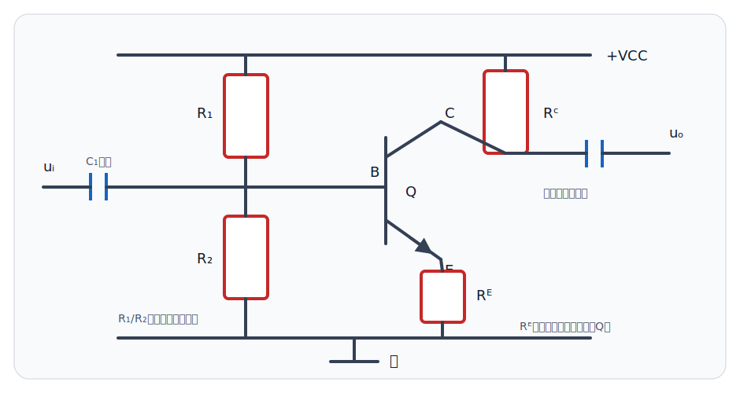
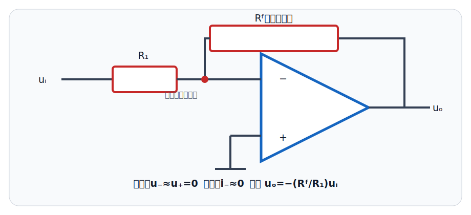
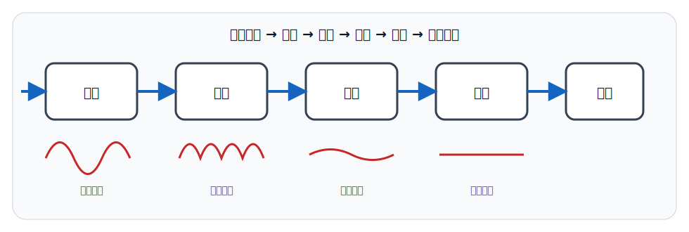

# 📚 模拟电子技术

使用说明：🔴红色 = 期末必须掌握的器件状态、公式和结论；🔵蓝色 = 分析电路的固定步骤与计算得分点；⚫️黑色 = 近似条件、波形理解和陷阱。本讲义按童诗白、华成英《模拟电子技术基础》常见章节组织，先帮助零基础学习者掌握核心得分内容，再扩展进阶分析。

## 零基础预备：模电在研究什么

考点0：模拟信号、放大与直流电源

⚫️【模拟信号】：幅度随时间连续变化的电压或电流，例如声音经麦克风转换后的微弱电压。数字信号通常只关心有限个离散电平。

⚫️【放大】：用较小的输入变化控制较大的输出变化。放大器不是“凭空制造能量”，输出增加的能量来自直流电源，输入信号只承担控制作用。

🔴【三类量要分开】：直流电源建立器件的静态工作条件；交流输入是要处理的信号；地是电位参考点，不必然等于物理大地。

考点0.1：为什么要先求静态、再求动态

⚫️晶体管是非线性器件。先用直流偏置把它放在合适的放大区工作点Q附近，再把小信号变化近似看成线性，才能使用电压增益和小信号等效电路。

🔵【静态分析】：只看直流，求 `IBQ、ICQ、UCEQ`。【动态分析】：只看交流小变化，求增益、输入电阻、输出电阻和频率响应。最后把直流与交流叠加理解真实波形。

考点0.2：读模电图的顺序

🔵1. 找电源、地、输入和输出；2. 识别核心有源器件；3. 沿直流通路找偏置；4. 沿交流通路找信号；5. 判断有无反馈；6. 检查输出摆幅是否会碰到截止或饱和。

⚫️【增益】：电压增益 `Av=uo/ui`，负号表示反相；分贝增益 `20lg|Av|`。不要把“增益为负”误解成信号幅度变小。

第一章：半导体与二极管

考点1：本征、杂质半导体与PN结

🔴【N型半导体】：多数载流子为自由电子，少数载流子为空穴；整体仍呈电中性。

🔴【P型半导体】：多数载流子为空穴，少数载流子为自由电子；P型不等于“带正电”。

🔴【PN结】：正向偏置使势垒降低、导通增强；反向偏置使势垒升高，通常近似截止。

考点2：二极管伏安特性与模型

🔴【核心特性】：单向导电。硅二极管工程估算常取导通压降约 `0.7 V`，锗管常取约 `0.2～0.3 V`，实际值随器件和电流变化。

🔴【三种模型】：理想模型导通压降为0；恒压降模型导通后压降近似固定；小信号模型在静态工作点附近用动态电阻表示。

🔵【判断步骤】：先假设导通或截止 → 按模型计算端电压和电流 → 检查结果是否满足假设 → 不满足则改判。

⚫️【坑点】：反向电压未达到击穿区时电流很小；普通二极管进入击穿区可能损坏，但稳压二极管可在限流条件下工作于反向击穿区。

考点3：整流、限幅与稳压

🔴【整流】：半波整流只利用一个半周期；桥式全波整流利用两个半周期，输出脉动频率是输入频率的2倍。

🔴【滤波电容】：接在整流输出端并联负载，利用充放电减小脉动；负载越重或电容越小，纹波通常越大。

🔴【稳压二极管】：反向击穿区稳压，必须串联限流电阻；稳压值近似为其击穿电压。

第二章：双极型晶体管与基本放大电路

考点4：BJT电流关系与工作区

🔴【电流关系】：`IE = IB + IC`；放大区近似 `IC = βIB`、`IE = (β+1)IB`。

| 状态 | NPN管发射结 | NPN管集电结 | 典型用途 |
|---|---|---|---|
| 截止 | 反偏或未充分正偏 | 反偏 | 开关断开 |
| 放大 | 正偏 | 反偏 | 线性放大 |
| 饱和 | 正偏 | 正偏 | 开关闭合 |

🔴【硅管估算】：导通时常取 `UBE ≈ 0.7 V`；饱和时常取 `UCE(sat) ≈ 0.2 V`，具体题目给定值优先。

⚫️【坑点】：`IC = βIB` 只适用于放大区，不能在饱和区继续使用；三极管放大的是能量受控的信号，输出能量来自直流电源。

考点5：静态工作点Q

🔴【作用】：静态工作点决定晶体管是否处于放大区，并影响最大不失真输出幅度。

🔵【直流通路】：令交流信号源为零，耦合和旁路电容视为开路，求 `IBQ、ICQ、UCEQ`。

🔵【固定偏置常用式】：`IBQ = (VCC-UBE)/RB`，`ICQ = βIBQ`，`UCEQ = VCC-ICQRC`；算完必须检查是否仍在放大区。

🔴【分压偏置】：基极分压网络配合发射极电阻可形成直流负反馈，使静态工作点对温度和β变化更稳定。

考点6：截止失真与饱和失真

🔴【判断本质】：看输出波形摆动时晶体管触及截止区还是饱和区，而不是只背“削顶/削底”。

⚫️【共射电路】：输出与输入反相，因此输入正半周使集电极电压下降，过大时可能进入饱和；输入负半周使集电极电压上升，过大时可能截止。

🔵【改善】：调整偏置使Q点大致居中或减小输入幅度。Q点过低更易截止，过高更易饱和。

考点7：小信号模型与性能指标

🔴【分析前提】：小信号变化围绕Q点，晶体管必须处于放大区。

🔵【交流通路】：直流电压源视为交流地；容量足够大的耦合、旁路电容视为短路；用小信号模型替代晶体管。

🔴【共射近似增益】：常见模型下 `Av ≈ -β(RC∥RL)/rbe`，负号表示反相；具体公式随发射极电阻是否旁路而变化。

🔴【输入/输出电阻】：输入电阻反映对信号源的负载；输出电阻反映带负载能力。计算时要明确是“放大级自身”还是“含偏置网络/负载后的整体”。

考点8：三种基本组态

| 组态 | 电压增益 | 相位 | 输入电阻 | 输出电阻 | 典型特点 |
|---|---|---|---|---|---|
| 共射 | 较大 | 反相 | 中等 | 较大 | 常用电压放大 |
| 共集/射极跟随器 | 约1 | 同相 | 高 | 低 | 缓冲、阻抗变换 |
| 共基 | 较大 | 同相 | 低 | 较大 | 高频性能较好 |

🔴【级联】：中频区总电压增益等于各级增益乘积；以分贝表示时相加，`Gv(dB) = 20lg|Av|`。

第三章：场效应管、差分与集成运放

考点9：MOS场效应管

🔴【控制方式】：MOS管是电压控制器件，栅极绝缘，输入电阻很高；BJT通常称电流控制器件。

🔴【增强型NMOS】：`VGS < Vth` 截止；`VGS > Vth` 后形成沟道。放大常工作在饱和区，开关完全导通常工作在可变电阻/三极区。

⚫️【坑点】：MOS管的“饱和区”对应恒流放大区，与BJT的饱和导通含义不同。

考点10：差分放大电路

🔴【差模与共模】：差模信号是两输入之差，共模信号是两输入中共同变化的部分。

🔴【共模抑制比】：`CMRR = |Ad/Ac|`，分贝表示为 `20lg|Ad/Ac|`；CMRR越大，抑制共模干扰能力越强。

🔴【恒流源尾电流】：可提高静态工作稳定性和共模抑制能力。

考点11：理想运算放大器

🔴【理想参数】：开环差模增益无穷大、输入电阻无穷大、输出电阻为零、共模抑制比无穷大。

🔴【线性区两条规则】：负反馈条件下 `u+ ≈ u-`（虚短），`i+ ≈ i- ≈ 0`（虚断）。

⚫️【坑点】：虚短不是两个输入端真正短路，虚断也不是输入端没有电压；正反馈或输出饱和时不能机械套用虚短。

考点12：基本运算电路

🔴【反相比例】：`uo = -(Rf/R1)ui`，输入端形成虚地。

🔴【同相比例】：`uo = (1+Rf/R1)ui`；电压跟随器是增益为1的特例。

🔴【反相加法】：`uo = -Rf(u1/R1 + u2/R2 + …)`。

🔴【积分】：`uo = -1/(RC)∫ui dt`；方波输入可得到三角波。

🔴【微分】：`uo = -RC·dui/dt`；工程电路通常加入限幅和频率补偿避免噪声放大。

🔵【运放计算步骤】：先确认负反馈且未饱和 → 标出虚短、虚断 → 对输入节点列KCL → 求输出 → 检查输出是否超过电源允许范围。

专题1：电压比较器

🔴【工作区】：比较器通常开环或带正反馈工作在非线性区，输出接近正、负饱和值；不能使用“虚短”求解。

🔴【单限比较器】：输入跨过一个阈值时输出翻转；过零比较器的阈值为0。

🔴【滞回比较器】：正反馈产生上、下两个不同阈值，具有回差，可提高抗噪声能力并把缓慢变化信号整形成矩形波。

🔴【窗口比较器】：判断输入是否落在上下两个阈值之间。

专题2：有源滤波器

🔴【四类】：低通允许低频通过；高通允许高频通过；带通允许某频段通过；带阻抑制某频段。

🔴【一阶滚降】：超过截止区后幅频特性渐近斜率通常为每十倍频约 `20 dB`；二阶约 `40 dB/十倍频`。

⚫️【坑点】：滤波器“截止频率”通常对应幅值下降到通带值的 `1/√2`，不是信号绝对为零。

第四章：负反馈放大电路

考点13：反馈极性与组态

🔴【负反馈】：反馈信号削弱净输入；正反馈增强净输入。瞬时极性法可沿信号通路标注正负变化判断。

🔴【输出取样】：在输出端并联取样电压属于电压反馈；在输出通路串联取样电流属于电流反馈。

🔴【输入比较】：反馈信号与输入串联比较属于串联反馈；在同一节点并联比较属于并联反馈。

考点14：负反馈对性能的影响

🔴【闭环增益】：`Af = A/(1+AF)`，其中后一个 `F` 为反馈系数；深度负反馈 `|AF| ≫ 1` 时，`Af ≈ 1/F`。

🔴【一般影响】：降低但稳定增益、减小非线性失真、抑制放大器内部噪声、展宽通频带。

🔴【电阻影响】：串联反馈提高输入电阻，并联反馈降低输入电阻；电压反馈降低输出电阻，电流反馈提高输出电阻。

⚫️【坑点】：负反馈不能消除反馈环外部已经混入的噪声，也不保证电路在任何频率都稳定；相移过大可能产生自激。

第五章：频率响应、振荡与功率放大

考点15：频率响应

🔴【低频下降】：耦合电容、旁路电容的容抗增大导致增益下降。

🔴【高频下降】：器件结电容和分布电容影响增强导致增益下降。

🔴【截止频率】：增益下降到中频增益的 `1/√2`，即约 `-3 dB`；带宽 `BW = fH - fL`。

考点16：正弦波振荡

🔴【振荡条件】：环路幅值条件 `|AF| = 1`，相位条件 `∠AF = 2kπ`；起振时通常要求环路增益略大于1，稳定后由非线性稳幅到1。

🔴【RC桥式振荡器】：适于低频，典型对称网络振荡频率 `f0 = 1/(2πRC)`，放大环节闭环增益通常需满足约3的起振条件。

🔴【LC振荡器】：适于较高频率，理想谐振频率近似 `f0 = 1/(2π√LC)`。

考点17：功率放大器

| 类别 | 导通角 | 特点 |
|---|---|---|
| A类 | 360° | 失真小、效率低 |
| B类 | 180° | 效率高、易有交越失真 |
| AB类 | 大于180°小于360° | 减小交越失真，效率居中 |
| C类 | 小于180° | 失真大，配合选频网络用于高频功放 |

🔴【互补对称B类】：理想最大效率 `ηmax = π/4 ≈ 78.5%`；两管在过零附近都未充分导通会产生交越失真。

🔴【AB类改善】：给功率管提供小的静态偏置，使过零附近仍有微小导通。

第六章：直流稳压电源

考点18：电源组成与指标

🔴【流程】：交流电网 → 变压 → 整流 → 滤波 → 稳压 → 直流负载。

🔴【桥式整流】：每半周有两只二极管导通；输出脉动频率为电网频率的2倍。

🔴【线性串联稳压】：调整管工作在线性区，输出纹波小但效率较低、压差功耗明显。

⚫️【稳压指标】：稳压系数反映输入变化影响，输出电阻反映负载变化影响；数值越小通常越好。

第七章：典型计算题

考点19：三极管状态判断例题

🔵【题目】：硅NPN管，`VCC = 5 V`，`RC = 1 kΩ`，基极电流 `IB = 0.1 mA`，`β = 100`。判断能否按放大区计算。

🔵【先假设放大】：`IC = βIB = 10 mA`，则 `RC` 压降应为 `10 V`，超过 `VCC`，物理上不可能。

🔵【结论】：原假设不成立，晶体管进入饱和区；不能继续使用 `IC = βIB`。

考点20：运放例题

🔵【题目】：反相放大器 `R1 = 10 kΩ`、`Rf = 50 kΩ`、`ui = 0.2 V`，求输出。

🔵【解】：`uo = -(Rf/R1)ui = -5×0.2 = -1 V`。若电源电压允许该输出，则工作在线性区。

考点21：深度负反馈例题

🔵【题目】：开环增益 `A = 1000`，反馈系数 `F = 0.01`，求闭环增益。

🔵【解】：`Af = 1000/(1+1000×0.01) ≈ 90.9`；因为环路增益为10，不宜直接把结果近似成 `1/F = 100` 而不说明误差。

第八章：期末自测与答案

考点22：自测题

1. P型半导体是否整体带正电？
2. NPN管放大区两个PN结分别如何偏置？
3. 共射放大器输出与输入同相还是反相？
4. 射极跟随器的电压增益、输入电阻和输出电阻有什么特点？
5. 运放虚短和虚断在什么条件下使用？
6. 电压串联负反馈怎样影响输入、输出电阻？
7. B类互补功放的主要失真是什么？
8. RC振荡器和LC振荡器通常分别适合什么频段？

考点23：自测答案

🔵1. 否，整体电中性。2. 发射结正偏、集电结反偏。3. 反相。4. 增益约1、输入电阻高、输出电阻低。5. 运放处于负反馈线性工作区。6. 输入电阻提高、输出电阻降低。7. 交越失真。8. RC偏低频，LC偏高频。

第九章：复习优先级与取舍

考点24：复习优先级

🔴【A级必会】：二极管状态、BJT三状态、静态工作点、共射/共集特点、虚短虚断、反相/同相运放、负反馈影响。

🔵【B级得分】：小信号增益、反馈组态、比较器、有源滤波、频率响应、振荡条件、功率放大、直流电源。

⚫️【C级选学】：复杂差分参数、精确高频模型、多级直接耦合漂移计算。先确保A级题型能独立完成。

第十章：公开试题提炼训练

考点25：网络题型分析

⚫️公开课程、考试大纲和试卷样例反复出现以下能力链：器件状态判断 → 放大电路静态/动态分析 → 反馈判断 → 运放运算 → 波形产生/比较 → 功放与电源。零基础应先学会“假设状态并回代检查”，再背公式。

| 题型 | 常见问法 | 核心动作 |
|---|---|---|
| 器件判断 | 二极管是否导通、BJT类型和状态 | 看偏置与端电位 |
| 放大电路 | 求Q点、增益、输入/输出电阻 | 分直流通路和交流通路 |
| 波形题 | 限幅、失真、比较器输出 | 找阈值和饱和值 |
| 反馈题 | 正/负反馈、四种组态、性能变化 | 瞬时极性＋取样/比较方式 |
| 运放题 | 比例、加减、积分与设计 | 虚短、虚断、节点KCL |
| 系统题 | 振荡、功放、整流滤波稳压 | 识别功能模块与工作区 |

考点26：基础层原创练习

1. 一个硅二极管采用恒压降 `0.7 V` 模型，`5 V` 电源经 `1 kΩ` 电阻和正向二极管串联到地，求电流。

2. 某NPN管处于放大区，`IB=20 μA、β=100`，求 `IC` 和 `IE`。

3. 共射、共集、共基中，哪一种常用于缓冲和阻抗变换？为什么？

4. 理想运放在负反馈线性区的两条分析规则是什么？

5. 电压串联负反馈对输入电阻和输出电阻分别有什么影响？

6. 比较器为什么一般不能使用“虚短”？

考点27：基础层答案

🔵1. 二极管正向导通，`I=(5-0.7)/1 kΩ=4.3 mA`。

🔵2. `IC=βIB=2 mA`，`IE=IB+IC=2.02 mA`。

🔵3. 共集电极，也叫射极跟随器；电压增益约1、输入电阻高、输出电阻低，适合级间缓冲。

🔵4. `u+≈u-`（虚短）和 `i+≈i-≈0`（虚断）。前提是负反馈且输出没有饱和。

🔵5. 串联反馈提高输入电阻，电压反馈降低输出电阻。

🔵6. 比较器通常开环或正反馈工作，输出进入正/负饱和区，不满足线性负反馈条件。

考点28：计算层原创练习

1. 固定偏置共射电路中 `VCC=12 V、RB=565 kΩ、RC=2 kΩ、β=100、UBE=0.7 V`。求Q点并检查工作状态。

2. NPN开关电路中 `VCC=5 V、RC=1 kΩ、IB=80 μA、β=100、UCE(sat)=0.2 V`。判断放大还是饱和，并估算集电极电流。

3. 反相运放中 `R1=20 kΩ、Rf=100 kΩ、ui=-0.3 V`，求输出。

4. 反相加法器中 `Rf=20 kΩ`，两输入分别通过 `10 kΩ` 和 `20 kΩ` 接入，`u1=0.5 V、u2=-0.2 V`，求输出。

5. 某两级放大器电压增益分别为 `-20` 和 `5`，求总增益、相位关系和分贝增益。

6. 某放大器中频增益为100，在截止频率处幅值增益约是多少？对应分贝相对中频下降多少？

考点29：计算层详细解析

🔵1. `IBQ=(12-0.7)/565 kΩ=20 μA`；`ICQ=βIBQ=2 mA`；`UCEQ=12-2 mA×2 kΩ=8 V`。`UCEQ` 明显高于饱和压降且集电极电流未受电源限制，可按放大区处理。

🔵2. 假设放大区，`IC=8 mA`；但外电路允许的饱和电流约 `IC(sat)=(5-0.2)/1 kΩ=4.8 mA`。预测值超过外电路上限，故进入饱和，实际集电极电流约4.8 mA，不能取8 mA。

🔵3. `uo=-(100/20)×(-0.3)=+1.5 V`。两个负号分别来自反相结构和负输入。

🔵4. `uo=-20k(0.5/10k + (-0.2)/20k)=-20k(50-10)μA=-0.8 V`。

🔵5. `Av=(-20)×5=-100`，负号表示总输出与输入反相；`20lg100=40 dB`。

🔵6. 截止频率处为中频幅值的 `1/√2`，所以约 `70.7`；相对下降约 `3 dB`。

考点30：综合判断练习

1. 某运放输出允许范围为 `±12 V`，按线性公式算得输出 `+18 V`。实际输出大约怎样？还能否继续用虚短分析？

2. 一个放大器引入负反馈后增益从200降到20。若反馈网络不变，说明这一变化换来了哪些典型好处？

3. 一个正弦波振荡器接通电源后没有外加输入却能输出稳定正弦波，它需要满足哪两个环路条件？起振初期与稳定后有何不同？

考点31：综合题答案

🔵1. 实际输出被限制在接近正饱和值，约 `+12 V` 附近，具体还取决于器件输出摆幅；进入饱和后不能继续使用虚短。

🔵2. 一般换来增益稳定性提高、失真减小、带宽展宽，并按反馈组态改变输入/输出电阻。不能笼统写“所有噪声都消失”。

🔵3. 稳定振荡时 `|AF|=1` 且总相移为 `2kπ`；起振初期环路增益需略大于1，使微小扰动增长，稳定后非线性稳幅使等效环路增益回到1。

第十一章：公开课程与教材依据

考点32：课程框架来源

⚫️【天津大学《模拟电子技术基础》】：https://www.icourse163.org/course/TJU-1003156001

⚫️【南京工程学院《电子技术基础—模拟电子技术》】：https://www.icourse163.org/course/NJIT-1002182003

⚫️【大学MOOC《模拟电子技术》完整章节大纲】：https://www.icourse163.org/course/detail.htm?cid=1206684820

⚫️【教材口径】：华成英、童诗白主编《模拟电子技术基础》是上述公开课程列出的主要参考教材之一；不同版次的符号和章节顺序可能略有差异。

⚫️【公开试卷题型样例】：https://elearning.gdpepe.edu.cn/suite/portal/res?key=21375876

⚫️【安徽三联学院模拟电子技术考试大纲】：https://zsb.slu.edu.cn/2021/0302/c462a32779/page.htm
