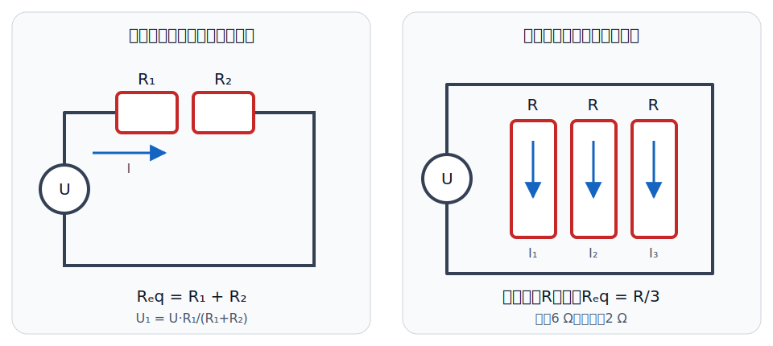
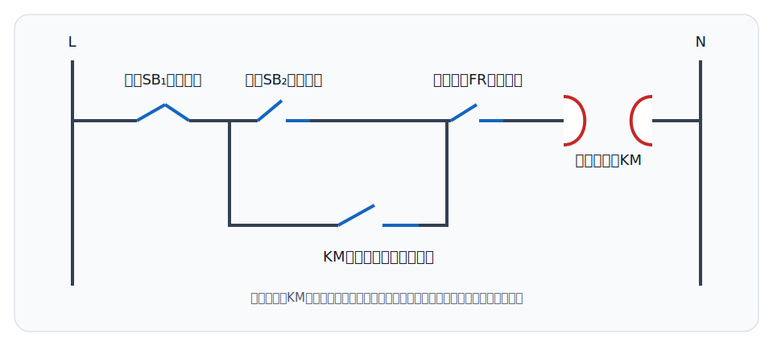

# 电路分析与电工技术：事业单位基础讲义

本讲义只保留基础专业知识常见的“概念—特点—要素—判断—一步计算”。学习目标不是推导复杂网络，而是能解释基本术语、识别元件和电路状态，并完成串并联、容抗、功率与可靠性的简单计算。

## 一、电路和基本物理量

### 1. 电路的组成与作用

电路是电流能够流过的完整路径，通常由电源、负载、连接导线以及控制和保护装置组成。

- 电源：把其他形式的能量转换为电能，如电池、发电机。
- 负载：消耗电能并转换为光、热、机械能等，如灯泡、电动机。
- 导线：连接各部分并传输电能或信号。
- 控制和保护装置：控制通断并在异常时保护设备，如开关、熔断器、断路器。

开路表示通路断开，电流为零，但断口两端可能有电压；短路表示两点被近似零电阻连接，短路两端电压近似为零，电流可能很大。

### 2. 电压、电流、电阻和功率

- 电流 `I`：电荷定向移动形成，单位安培（A）。
- 电压 `U`：推动电荷移动的电位差，单位伏特（V）。
- 电阻 `R`：导体对电流的阻碍作用，单位欧姆（Ω）。
- 电功率 `P`：单位时间内转换的电能，单位瓦特（W）。

最基本公式：`U=IR`，`P=UI=I²R=U²/R`。使用公式前必须统一单位。

### 3. 直流与交流

直流电的方向通常不随时间改变；交流电的大小和方向随时间周期性变化。电池提供直流，日常电网通常提供正弦交流。

正弦交流电三要素是最大值、角频率（或频率）和初相位。有效值反映交流电产生热效应的能力；我国常见“220 V 市电”指有效值，不是最大值。

## 二、基本定律与连接方式

### 1. 欧姆定律

在适用条件下，导体两端电压与电流成正比：`I=U/R`。电阻不变时，电压越大，电流越大；电压不变时，电阻越大，电流越小。

判断题常设陷阱：“任何元件都满足 `U=IR`”是错误的。欧姆定律适用于线性电阻等满足相应条件的元件。

### 2. 串联和并联

串联电路只有一条电流路径，各元件电流相同，总电压等于各部分电压之和：

- 等效电阻：`R=R1+R2+…`
- 电阻越大，分得的电压越大。

并联电路各支路接在相同两点之间，各支路电压相同，总电流等于各支路电流之和：

- `1/R=1/R1+1/R2+…`
- 相同的 `n` 个电阻并联：`R总=R/n`
- 支路电阻越小，分得的电流越大。

例：三个 `6 Ω` 电阻并联，`R总=6/3=2 Ω`。

### 3. 基尔霍夫定律

- KCL（电流定律）：任一节点流入电流之和等于流出电流之和，体现电荷守恒。
- KVL（电压定律）：任一闭合回路中各段电压代数和为零，体现能量守恒。

事业单位基础题通常考定律名称、物理含义和简单补缺值，不要求列复杂方程组。

## 三、电阻、电容与电感

### 1. 电阻

电阻主要起限流、分压、偏置和将电能转换为热能等作用。额定功率表示电阻在规定条件下允许长期承受的功率，实际功率不应超过额定值。

### 2. 电容

电容器具有储存电荷和电场能量的作用。其基本特性可概括为“隔直通交”：在稳定直流状态下理想电容相当于开路，对变化信号则表现出容抗。

容抗：`XC=1/(2πfC)`。频率 `f` 越高或电容量 `C` 越大，容抗越小。计算时注意把微法换成法：`1 μF=10⁻⁶ F`。

例：`f=50 Hz，C=100 μF`，则 `XC≈31.8 Ω`。这类直接代公式的一步题需要会做。

### 3. 电感

电感器能储存磁场能量，基本特性可概括为“通直阻交”。感抗 `XL=2πfL`，频率或电感量越大，感抗越大。

电容电压和电感电流在一般换路瞬间不能突变。这是判断题常见结论，不要求在本平台完成复杂暂态推导。

## 四、交流、电工控制与安全

### 1. RLC 基本相位关系

- 纯电阻：电压与电流同相。
- 纯电感：电流滞后电压。
- 纯电容：电流超前电压。
- 串联 RLC 谐振：`XL=XC`，总电路呈电阻性，电压与电流同相，功率因数为1。

### 2. 交流功率与功率因数

- 有功功率 `P`：真正转化为机械能、热能等并被负载利用的平均功率，单位是瓦（W）。
- 无功功率 `Q`：电源与电感、电容之间往返交换的功率，单位是乏（var）；它本身不直接做有用功，但维持电动机、变压器等设备的电磁场需要无功功率。
- 视在功率 `S`：按交流电压、电流有效值衡量的总供电容量，单位是伏安（VA）。
- 功率因数：有功功率占视在功率的比例，即 `P/S`；正弦稳态中常写作 `cosφ`。功率因数越接近1，同样有功功率所需电流通常越小。

提高功率因数可以减小线路电流和线路损耗，降低电压损失，并提高供电设备容量的利用率。感性负载常采用并联电容补偿，但补偿不是“增加负载有功功率”，也不是越多越好；过度补偿会使系统呈容性。

### 3. 三相交流和电动机

三相交流电由三个频率相同、幅值相同、相位互差120°的正弦电动势组成，具有传输经济、功率较稳定、便于产生旋转磁场等特点。

三相异步电动机主要由定子和转子组成。其基本原理是定子三相绕组产生旋转磁场，转子因电磁感应产生转矩。异步电动机正常运行时，转子转速低于同步转速。

### 4. 变压器与电压表、电流表接法

变压器利用电磁感应传递交流电能，基本作用是升高或降低交流电压，还可用于电气隔离和阻抗变换。变压器不能直接变换恒定直流电压；理想变压器升压时二次侧电流相应减小，降压时二次侧电流相应增大。

- 电压表测量元件两端的电压，应与被测元件并联；其内阻应尽量大，以减小对原电路的影响。
- 电流表测量支路中的电流，应串联接入被测支路；其内阻应尽量小，以减小附加压降。

判断接法时抓住“电压表跨两端、电流表进支路”。电流表不能直接并接在电源两端，否则可能形成近似短路；电压表也不能串联代替电流表。

### 5. 常用低压电器

- 熔断器：主要用于短路保护，熔体熔断后需要更换。
- 断路器：发生过载或短路时可自动切断，并可复位使用。
- 热继电器：主要用于电动机长期过载保护，不适合代替短路保护。
- 接触器：利用电磁机构频繁接通或断开主电路。
- 按钮：发出控制命令，常开和常闭触点状态按未按下时判断。

自锁使启动按钮松开后接触器仍保持吸合；互锁用于防止两个不允许同时工作的接触器同时吸合。

### 6. 安全用电

安全用电包括正确接地、使用合适的保护装置、保持绝缘完好、避免湿手操作、检修前断电验电等。保护接地用于降低设备外壳意外带电时的触电风险；不能把保险丝换成粗铜丝。

电气设备的额定电压、额定电流和额定功率表示制造者规定的正常工作条件。实际使用时应选择与电源和负载相匹配的额定值，并为启动冲击、温升和环境条件留出合理余量。“额定值越大越安全”并不成立，例如保护装置额定电流过大会失去应有的保护作用。

## 五、可靠性基础

若若干独立元件必须全部正常，系统才正常，这是串联系统，系统可靠度等于各元件可靠度的乘积：`R=R1×R2×…`。

例：两个可靠度均为0.9的元件组成串联系统，系统可靠度为 `0.9×0.9=0.81`。这里的“串联”是可靠性逻辑，不是计算电阻串联值。

若任一并联支路正常系统就能工作，理想独立并联系统可靠度可用“1减去全部失效概率”计算。基础考试更常考串联系统乘法和概念判断。

## 六、基础简答题答法

### 简答1：说明串联电路与并联电路的特点

建议按“电流—电压—等效电阻”三点作答：串联电流相同、总电压为分电压之和、总电阻为各电阻之和；并联电压相同、总电流为支路电流之和、总电阻小于任一支路电阻。

### 简答2：电容和电感的基本作用有什么不同

电容储存电场能量，稳定直流时相当于开路，频率越高容抗越小；电感储存磁场能量，稳定直流时理想情况下相当于短路，频率越高感抗越大。

### 简答3：熔断器、热继电器和接触器分别有什么作用

熔断器用于短路保护；热继电器用于长期过载保护；接触器用于远距离、频繁控制主电路通断。答题时不要把控制元件和保护元件混为一谈。

## 七、高频判断纠错

1. 开路处电流为零，所以电压也一定为零。——错误，断口可能承受电压。
2. 并联总电阻大于任一支路电阻。——错误，并联总电阻更小。
3. 电容越大、频率越高，容抗越小。——正确。
4. 纯电感电路中电流超前电压。——错误，电流滞后电压。
5. 热继电器主要用于短路保护。——错误，主要用于过载保护。
6. 两个可靠度0.9的元件串联系统可靠度仍为0.9。——错误，应为0.81。
7. 无功功率不直接做有用功，所以交流系统完全不需要无功功率。——错误，许多设备建立电磁场需要无功功率。
8. 提高功率因数通常能减小同样有功功率下的线路电流和损耗。——正确。
9. 电压表应串联、电流表应并联。——错误，电压表并联，电流表串联。
10. 普通变压器可以直接变换恒定直流电压。——错误。

## 八、考前自测

1. 电路通常由哪些部分组成？
2. 开路和短路各有什么特点？
3. 三个 `6 Ω` 电阻并联后的等效电阻是多少？
4. 正弦交流电三要素是什么？
5. 容抗与频率、电容量分别是什么关系？
6. KCL和KVL分别体现什么守恒关系？
7. 三相异步电动机为什么称为“异步”？
8. 两个可靠度均为0.9的独立元件串联，系统可靠度是多少？
9. 有功功率、无功功率和视在功率各表示什么？提高功率因数有什么意义？
10. 变压器有哪些基本作用？电压表和电流表应怎样接入电路？
