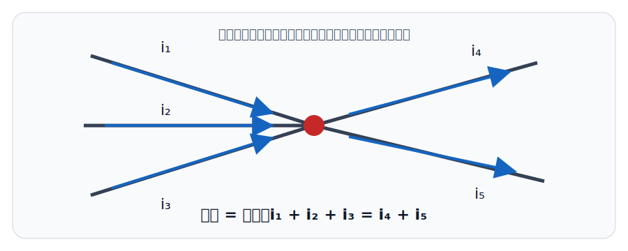
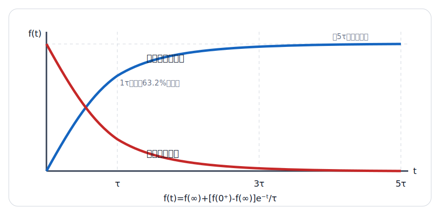
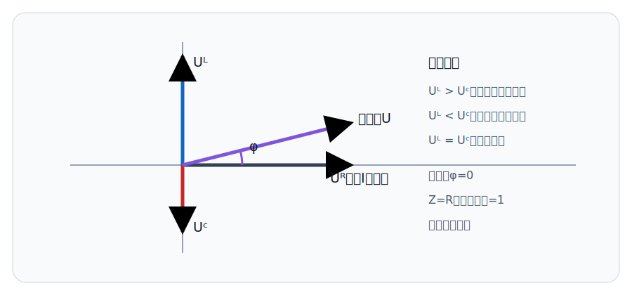

# 📚 电路分析与电工技术

使用说明：🔴红色 = 期末必须掌握的定律、公式和判断结论；🔵蓝色 = 计算题标准步骤与得分点；⚫️黑色 = 条件、解释和常见陷阱。以大学《电路分析基础》《电工技术》常见期末范围为骨架，带“选学”的内容在核心知识掌握后处理。

## 零基础预备：先学会“看电路”

考点0：电路到底是什么

⚫️【电路】：电流能够流过的完整路径。最小的实际电路通常包含电源、负载、连接导线和控制/保护元件。电源提供能量，负载把电能转化为光、热、机械能或其他形式。

⚫️【直流与交流】：直流DC的方向通常不随时间改变；交流AC的大小和方向随时间周期变化。电池属于直流源，市电属于正弦交流源。

⚫️【节点】：两条或多条支路的连接点；理想导线连接在一起的所有点电位相同。【支路】：流过同一电流的一段电路。【回路】：沿支路走一圈后回到出发点的闭合路径。

🔴【开路】：电流为0，端口电压不一定为0；【短路】：端口电压为0，电流不一定为0。这是零基础最容易混淆的一对概念。

考点0.1：单位与数量级

🔴【常用单位】：电压V、电流A、电阻Ω、电容F、电感H、频率Hz、功率W、能量J。

🔴【前缀】：`k=10³`、`M=10⁶`、`m=10⁻³`、`μ=10⁻⁶`、`n=10⁻⁹`、`p=10⁻¹²`。例如 `100 μF = 100×10⁻⁶ F`。

⚫️【计算习惯】：代公式前先统一单位；结果应带单位；最后检查数量级是否合理。

考点0.2：零基础做题通用流程

🔵1. 看清电路拓扑：哪些元件真正串联，哪些真正并联。

🔵2. 标出已知量、未知量和参考方向，不要只凭“看起来”判断正负。

🔵3. 先化简能化简的部分，再选欧姆定律、KCL/KVL、节点法或网络定理。

🔵4. 解完用功率守恒、极端情况和数量级复核。

第一章：电路模型与基本定律

考点1：电流、电压、功率与参考方向

🔴【关联参考方向】：电流流入电压正端时，元件吸收功率 `p = ui`；算得 `p > 0` 表示吸收功率，`p < 0` 表示发出功率。

🔴【功率守恒】：任一完整电路中，各元件功率代数和为零，即 `Σp = 0`。

⚫️【坑点】：电压或电流算出负值不代表计算错误，只表示实际方向与所设参考方向相反。

考点2：欧姆定律、KCL与KVL

🔴【欧姆定律】：关联参考方向下 `u = Ri`。

🔴【KCL】：任一节点流入电流之和等于流出电流之和，等价写作 `Σi = 0`。

🔴【KVL】：任一闭合回路中各段电压代数和为零，即 `Σu = 0`。

🔵【列方程步骤】：先标参考方向 → 选节点或回路 → 统一正负号 → 解方程 → 用功率守恒或数量级复核。

考点3：串并联与分压分流

🔴【电阻串联】：`Req = R1 + R2 + …`；同一电流，电压按电阻成比例分配。`Uk = U·Rk/ΣR`。

🔴【电阻并联】：`1/Req = 1/R1 + 1/R2 + …`；同一电压，电流与电阻成反比分配。两支路时 `I1 = I·R2/(R1+R2)`。

🔴【相同电阻】：`n` 个相同的 `R` 并联，`Req = R/n`。三个 `6 Ω` 并联为 `2 Ω`。

⚫️【坑点】：分压公式要求串联支路中间没有额外负载；接入负载后应先求并联等效电阻。

考点4：理想电源与实际电源

🔴【理想电压源】：端电压由电源规定；不同电压的理想电压源不能直接并联。

🔴【理想电流源】：支路电流由电源规定；不同电流的理想电流源不能直接串联。

🔴【电源等效变换】：电压源 `Us` 串联 `R` 可等效为电流源 `Is = Us/R` 并联同一个 `R`，外部端口特性不变。

⚫️【坑点】：等效只针对外部端口，不能用等效后的内部支路电流或功率替代原电路内部量。

第二章：线性电阻电路的系统分析

考点5：支路、节点与网孔分析

🔴【节点电压法】：以参考节点为零电位，对其余独立节点列KCL；电阻支路电流写成“本节点电压减邻节点电压，再除以电阻”。

🔴【网孔电流法】：对平面电路的独立网孔设网孔电流并列KVL；公共电阻压降由两个网孔电流之差决定。

🔵【超级节点】：理想电压源跨接两个非参考节点时，把两节点整体列KCL，再补充电压约束方程。

🔵【超级网孔】：电流源位于两个网孔公共支路时，绕开该支路列KVL，再补充网孔电流关系。

考点6：叠加定理

🔴【适用范围】：线性电路中，多个独立源共同产生的电压或电流响应等于各独立源单独作用响应的代数和。

🔵【置零规则】：独立电压源置零后短路；独立电流源置零后开路；受控源必须保留。

⚫️【坑点】：功率是电压或电流的二次函数，不能直接使用叠加定理。

考点7：戴维宁与诺顿定理

🔴【戴维宁等效】：任一线性含源二端网络可等效为开路电压 `Uoc` 串联等效电阻 `Rth`。

🔴【诺顿等效】：可等效为短路电流 `Isc` 并联 `Rn`，且 `Rn = Rth`、`Uoc = IscRth`。

🔵【求Rth】：关掉全部独立源，从端口向内看等效电阻；含受控源时保留受控源，并在端口加测试源，用 `Rth = Utest/Itest`。

🔴【最大功率传输】：直流纯电阻负载满足 `RL = Rth` 时功率最大，`Pmax = Uth²/(4Rth)`；此时效率只有50%。

考点8：常用网络定理（选学）

🔴【替代定理】：已知某支路的电压和电流时，可用具有相同端口电压、电流的理想源替代该支路，但不能据此研究替代后该支路内部变化。

🔴【互易定理】：仅适用于单一独立源激励的线性、双向网络；含受控源或非线性元件时不能随意套用。

第三章：动态电路

考点9：电容与电感

🔴【电容】：`iC = C·duC/dt`，储能 `WC = 1/2·C·uC²`；直流稳态时理想电容相当于开路。

🔴【电感】：`uL = L·diL/dt`，储能 `WL = 1/2·L·iL²`；直流稳态时理想电感相当于短路。

🔴【换路定则】：无冲激电流时 `uC(0+) = uC(0-)`；无冲激电压时 `iL(0+) = iL(0-)`。

⚫️【坑点】：连续的是电容电压和电感电流，不是电容电流和电感电压。

考点10：一阶电路三要素法

🔴【统一表达式】：`f(t) = f(∞) + [f(0+) - f(∞)]e^(-t/τ)`，适用于一阶RC/RL电路的零输入、零状态和全响应。

🔴【时间常数】：RC电路 `τ = ReqC`；RL电路 `τ = L/Req`。求 `Req` 时从储能元件端口向内看并关掉独立源。

🔵【三要素】：求初值 `f(0+)` → 求终值 `f(∞)` → 求时间常数 `τ` → 代入统一式。

⚫️【数量级】：经过约 `τ` 达到总变化的63.2%，约 `3τ` 达到95%，约 `5τ` 可视为稳态。

考点11：二阶电路（选学）

🔴【典型形式】：二阶RLC自然响应可能为过阻尼、临界阻尼或欠阻尼；欠阻尼时出现衰减振荡。

⚫️【考试策略】：若课程范围没有二阶微分方程，先掌握阻尼类型判断和储能元件初值；完整推导放在核心内容掌握后学习。

第四章：正弦稳态交流电路

考点12：正弦量三要素与有效值

🔴【表达式】：`u(t) = Um sin(ωt + φ)`；三要素为最大值 `Um`、角频率 `ω`、初相位 `φ`。

🔴【频率关系】：`ω = 2πf`，`T = 1/f`。正弦量有效值 `U = Um/√2`、`I = Im/√2`。

⚫️【坑点】：交流电表通常显示有效值；相量只表示同频正弦量，不包含时间因子。

考点13：相量与阻抗

🔴【三种阻抗】：电阻 `ZR = R`；电感 `ZL = jωL = jXL`；电容 `ZC = 1/(jωC) = -j/(ωC) = -jXC`。

🔴【容抗】：`XC = 1/(2πfC)`，单位Ω；频率或电容量越大，容抗越小。

🔴【感抗】：`XL = 2πfL`，单位Ω；频率或电感量越大，感抗越大。

🔵【交流计算】：把正弦量化为相量 → 用复阻抗列KCL/KVL → 复数运算 → 转回幅值与相位。

考点14：RLC串联与谐振

🔴【串联阻抗】：`Z = R + j(XL - XC)`；`|Z| = √[R²+(XL-XC)²]`。

🔴【相位判断】：`XL > XC` 为感性、电流滞后；`XL < XC` 为容性、电流超前；相等时为纯电阻性。

🔴【串联谐振】：`ω0 = 1/√(LC)`，`f0 = 1/(2π√LC)`；谐振时 `XL = XC`、阻抗最小、电流最大、功率因数为1。

考点15：交流功率与功率因数

🔴【功率】：有功功率 `P = UIcosφ`，无功功率 `Q = UIsinφ`，视在功率 `S = UI`，满足 `S² = P² + Q²`。

🔴【功率因数】：`cosφ = P/S`。感性负载常并联电容补偿，使线路电流和无功功率减小；负载有功功率通常不因此改变。

⚫️【坑点】：不能把视在功率的单位VA写成W；无功功率单位为var。

第五章：三相电路、变压器与可靠性

考点16：对称三相电路

🔴【星形Y接】：`UL = √3Up`，`IL = Ip`。

🔴【三角形Δ接】：`UL = Up`，`IL = √3Ip`。

🔴【对称三相功率】：`P = √3ULILcosφ`，其中 `UL、IL` 为线电压和线电流。

⚫️【坑点】：线量和相量关系取决于接法，不能固定写成“线电压总是相电压的√3倍”。

考点17：互感与理想变压器（选学）

🔴【理想变压器】：`U1/U2 = N1/N2`，电流比与匝数比相反，`I1/I2 = N2/N1`；理想情况下输入输出功率相等。

🔴【阻抗折算】：负载折算到原边为 `Zin = (N1/N2)²ZL`。

考点18：系统可靠性

🔴【前提】：以下公式要求各元件失效相互独立，且题目对“系统成功”的定义明确。

🔴【串联系统】：任一元件失效系统即失效，`Rs = ΠRi`。两个可靠度0.9的元件串联，`Rs = 0.9² = 0.81`。

🔴【并联系统】：至少一个元件成功系统就成功，`Rp = 1 - Π(1-Ri)`。两个可靠度0.9的元件并联，`Rp = 1 - 0.1² = 0.99`。

⚫️【坑点】：可靠性“串联/并联”描述的是功能逻辑，不等同于电阻物理连接，也不使用电阻分压、分流公式。

专题1：三相异步电动机（课程名含“电工技术”时常考）

🔴【旋转磁场】：三相对称电流在定子绕组中产生旋转磁场；转子转速必须略低于同步转速才有相对运动并产生感应电流和电磁转矩。

🔴【同步转速】：`n1 = 60f/p` r/min，其中 `p` 为磁极对数；转差率 `s = (n1-n)/n1`。电动运行时通常 `0<s<1`。

🔴【起动与调速】：直接起动电流大；Y-Δ起动可降低起动电流和起动转矩；变频调速通过改变电源频率调节同步转速。

⚫️【坑点】：异步电动机正常运行时转子转速不等于同步转速；若完全相等则相对切割磁力线消失，电磁转矩不能维持。

专题2：继电接触控制（课程名含“电工技术”时常考）

🔴【自锁】：接触器常开辅助触点与启动按钮并联，使按钮松开后线圈继续得电。

🔴【互锁】：正、反转接触器的常闭辅助触点交叉串入对方线圈，防止两接触器同时吸合造成相间短路。

🔴【保护分工】：熔断器/断路器用于短路保护；热继电器用于长期过载保护；接触器失电释放可形成失压保护。

⚫️【点动与长动】：点动没有自锁，按下运行、松开停止；长动使用自锁维持运行。

第六章：典型计算题

考点19：并联电阻例题

🔵【题目】：三个 `6 Ω` 电阻并联，求等效电阻。

🔵【解】：相同电阻并联，`Req = R/n = 6/3 = 2 Ω`。

考点20：容抗例题

🔵【题目】：`f = 50 Hz`、`C = 100 μF`，求容抗。

🔵【解】：先换单位 `C = 100×10⁻⁶ F`；`XC = 1/(2πfC) ≈ 31.8 Ω`。

考点21：戴维宁负载例题

🔵【题目】：某网络等效为 `Uth = 12 V`、`Rth = 3 Ω`，接 `RL = 3 Ω`，求负载功率。

🔵【解】：`I = 12/(3+3) = 2 A`，`PL = I²RL = 12 W`；因 `RL = Rth`，这也是最大功率。

第七章：期末自测与答案

考点22：自测题

1. 两个 `8 Ω` 电阻并联后的等效电阻是多少？
2. 叠加定理能否直接叠加各独立源产生的功率？
3. 电容电压和电感电流在一般换路瞬间是否连续？
4. `f` 增大一倍、`C` 不变时，`XC` 如何变化？
5. RLC串联谐振时电路呈感性、容性还是电阻性？
6. 戴维宁电阻为 `5 Ω` 时，纯电阻负载取多少可得最大功率？
7. 两个独立可靠度均为0.8的串联系统可靠度是多少？
8. 对称Y接负载中，线电压和相电压是什么关系？

考点23：自测答案

🔵1. `4 Ω`。2. 不能。3. 一般连续。4. 变为原来的一半。5. 电阻性。6. `5 Ω`。7. `0.64`。8. `UL = √3Up`。

第八章：复习优先级与取舍

考点24：复习优先级

🔴【A级必会】：串并联、KCL/KVL、分压分流、正弦三要素、有效值、容抗/感抗、RLC相位、可靠性。

🔵【B级得分】：节点法、叠加、戴维宁、三要素法、交流功率、三相关系；若课程名称含“电工技术”，再加异步电动机与继电接触控制。

⚫️【C级选学】：二阶电路、互易定理、耦合电感与复杂二端口。只有明确在考试范围内且A级已掌握后再学。

第九章：公开试题提炼训练

考点25：网络题型分析

⚫️公开课程大纲与历年试卷栏目显示，电路期末通常不是只考电阻串并联，而是形成“基本定律 → 一般分析方法 → 网络定理 → 动态电路 → 正弦稳态/三相”的完整链条。某高校公开大纲的一个样例把一般分析方法列为38%、正弦稳态22%、动态电路18%；这不是全国统一比例，但说明综合计算题是主要得分区。

| 题型 | 常见任务 | 本讲义对应方法 |
|---|---|---|
| 基础判断 | 参考方向、开短路、功率正负、串并联 | 欧姆定律与拓扑识别 |
| 方程分析 | 节点电压、网孔电流、受控源 | KCL/KVL、超级节点/网孔 |
| 网络定理 | 叠加、戴维宁、最大功率 | 求开路电压和端口电阻 |
| 动态电路 | 初值、终值、时间常数 | 三要素法 |
| 交流综合 | 阻抗、相位、功率、谐振 | 相量法 |
| 电工应用 | 三相功率、电动机、控制回路 | 线相量关系与控制逻辑 |

考点26：基础层原创练习

1. `12 Ω、6 Ω、4 Ω` 三个电阻并联，求等效电阻。

2. 某节点有 `2 A` 和 `3 A` 流入，已有 `1.2 A` 流出，另一流出电流是多少？

3. 使用叠加定理令一个独立电压源单独不作用时，应把它替换为什么？受控源是否关闭？

4. 换路前电容电压为 `5 V`、电感电流为 `0.4 A`，无冲激条件下求 `uC(0+)` 和 `iL(0+)`。

5. 两个功能元件可靠度分别为0.95和0.9，任一失效系统就失效。系统可靠度是多少？

考点27：基础层答案与思路

🔵1. `1/R = 1/12+1/6+1/4 = 1/2`，所以 `R=2 Ω`。并联结果必须小于最小支路电阻4 Ω，数量级合理。

🔵2. 由KCL：`2+3=1.2+I`，得 `I=3.8 A`。

🔵3. 独立电压源置零后用短路替代；受控源必须保留，因为它是电路内部关系的一部分。

🔵4. 电容电压、电感电流连续，故 `uC(0+)=5 V`、`iL(0+)=0.4 A`。

🔵5. 串联系统 `R=0.95×0.9=0.855`。这不是电阻串联计算。

考点28：计算层原创练习

1. 一个 `12 V` 电源串联 `3 Ω` 与 `6 Ω`，以 `6 Ω` 两端为输出。求该端口的戴维宁电压和戴维宁电阻；再接 `2 Ω` 负载，求负载功率。

2. RC充电电路中 `R=100 kΩ`、`C=10 μF`，电容初始电压为0，最终电压为10 V。求时间常数和 `t=1 s` 时电容电压。

3. 串联交流电路中 `R=20 Ω、XL=30 Ω、XC=15 Ω`，端电压有效值100 V。求阻抗、总电流、功率因数和有功功率。

4. 对称三相负载的线电压380 V、线电流10 A、功率因数0.8，求总有功功率。

5. 50 Hz四极异步电动机运行转速1440 r/min，求同步转速和转差率。

考点29：计算层详细解析

🔵1. 开路时是分压电路，`Uth=12×6/(3+6)=8 V`。关闭电压源后，端口看到 `3 Ω∥6 Ω=2 Ω`，故 `Rth=2 Ω`。接 `RL=2 Ω` 后电流 `I=8/(2+2)=2 A`，负载功率 `PL=I²RL=8 W`；同时满足最大功率条件。

🔵2. `τ=RC=100×10³×10×10⁻⁶=1 s`。`uC(t)=10(1-e⁻ᵗ)`，故 `uC(1)=10(1-e⁻¹)≈6.32 V`。

🔵3. `Z=20+j(30-15)=20+j15 Ω`，`|Z|=25 Ω`；`I=100/25=4 A`；`cosφ=20/25=0.8`，为感性；`P=UIcosφ=100×4×0.8=320 W`。

🔵4. `P=√3ULILcosφ≈1.732×380×10×0.8≈5.27 kW`。

🔵5. 四极即磁极对数 `p=2`，`n1=60f/p=1500 r/min`；`s=(1500-1440)/1500=0.04=4%`。

考点30：错题诊断

⚫️若第1题错，多半是不会从负载端“向内看”等效网络；若第2题错，重点复习单位换算和三要素法；若第3题错，重点练复数阻抗与有效值；若第4题错，通常混淆线量和相量；若第5题错，通常把极数和极对数混用。

第十章：公开课程依据

考点31：课程框架来源

⚫️【南京邮电大学《电路分析基础》】：https://www.icourse163.org/course/NJUPT-1001656002

⚫️【北京邮电大学《电路分析基础》】：https://www.icourse163.org/course/BUPT-1003377004

⚫️【北京交通大学《电路》】：https://www.icourse163.org/course/NJTU-1002084010

⚫️【中南大学《电工技术A》教学大纲】：https://dgdz.csu.edu.cn/theory_teach/electrotechnics_A/teaching_outline/teaching_outline.html

⚫️【哈尔滨工业大学《电工技术》】：https://www.icourse163.org/course/HIT-1206448827

⚫️【浙江万里学院公开考核范围与比例】：https://kcsz.zwu.edu.cn/b2/fb/c6537a176891/page.htm

⚫️【福建工程学院电路历年试卷栏目】：https://ceep.fjut.edu.cn/_t1273/3851/list.htm
