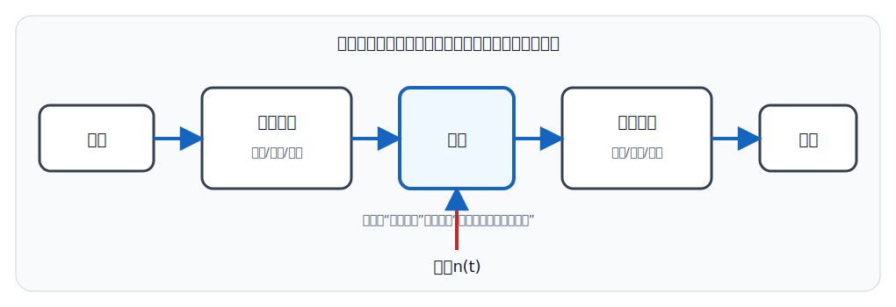
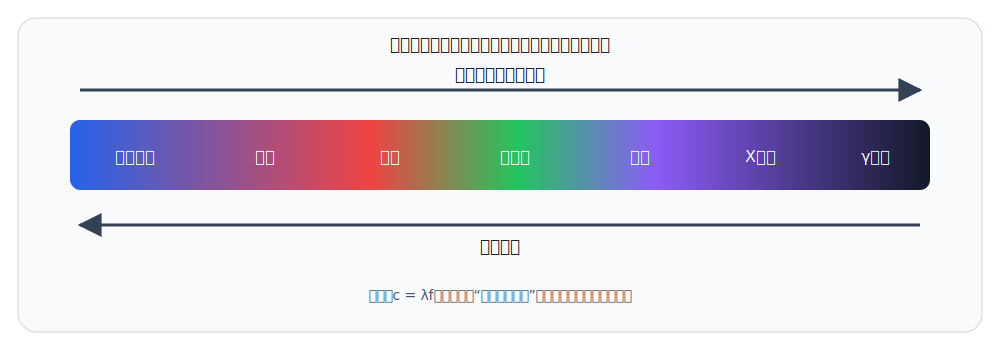
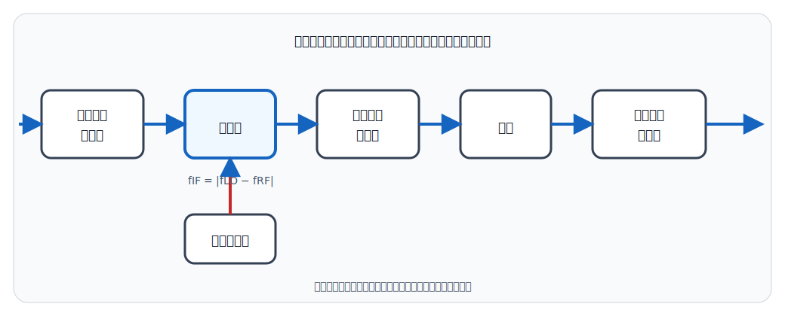

# 通信原理与高频电子线路

## 一、通信系统基础
<!-- exam: A | 单选、判断、多选、填空 -->

### 1. 通信的基本任务

通信的基本任务是可靠、有效地把信息从发送端传到接收端。一个典型通信系统包括：

1. 信源：产生消息。
2. 发送设备：把消息转换、调制和放大成适合传输的信号。
3. 信道：信号传播的媒介。
4. 噪声源：传输中引入的不希望出现的干扰。
5. 接收设备：选择、放大、解调并恢复消息。
6. 信宿：信息的最终接收者。

消息是要表达的内容，信息是消息中消除不确定性的部分，信号是承载信息的物理量。三者相关但不是同义词。

### 2. 模拟通信与数字通信

- 模拟通信：传输的信号参数连续变化，系统较直观，但抗噪声和再生能力通常较弱。
- 数字通信：以离散符号传输，抗干扰能力较强，便于加密、存储、处理和复用，但需要编码、同步和数模/模数转换等环节。

数字通信不是绝对没有噪声或误码，只是可以通过再生、编码和差错控制提高可靠性。

### 3. 单工、半双工和全双工

- 单工：信息只能单向传输，如广播电台向听众播送。
- 半双工：双方都能发送，但不能同时发送，如普通对讲机。
- 全双工：双方能同时双向传输，如普通电话通话。

三者的区别同时取决于传输方向和双方能否同时发送。半双工允许双向传输，但同一时刻只有一方发送。

## 二、信号、信道与性能指标
<!-- exam: A | 单选、判断、填空、计算 -->

### 1. 频率、周期与波长

频率表示单位时间内重复次数，单位赫兹（Hz）；周期是完成一次重复所需时间，`T=1/f`。在传播速度一定时，波长 `λ=v/f`，因此频率越高，波长越短。

### 2. 码元速率与信息速率

- 码元速率：每秒传输的码元数，单位Baud。
- 信息速率：每秒传输的比特数，单位bit/s。

二进制中一个码元通常携带1 bit，所以数值可能相等；多进制中一个码元可携带多个比特，两者不能混为一谈。

若每个码元有 `M` 种等可能状态，每个码元可携带 `log₂M` bit，信息速率与码元速率的关系为 `Rb=RB log₂M`。例如四进制传输的码元速率为 `1200 Baud`，则理想信息速率为 `2400 bit/s`。

### 3. 有效性与可靠性

- 有效性：常看传输速率、带宽利用率等，强调“传得快、占得少”。
- 可靠性：常看误码率、信噪比等，强调“传得准”。

带宽越宽通常可支持更高传输速率，但还受信噪比、调制方式、编码和设备性能影响。

### 4. 香农公式

香农公式：`C=B log₂(1+S/N)`。

- `C`：有噪声信道的理论极限容量。
- `B`：信道带宽。
- `S/N`：线性信噪比。

公式说明提高带宽或信噪比都能提高理论容量，但信噪比的收益是对数增长。香农容量是理论上限，不等于任何实际系统必然达到的速率。

**通俗理解：** 可以把信道想成一条有噪声的运输通道：带宽 `B` 类似可同时通行的通道宽度，信噪比 `S/N` 类似货物标识相对背景干扰的清晰程度。加宽通道和提高辨识度都能增加可靠传送的信息量，但辨识度继续提高时收益逐渐变小，这对应对数关系。香农公式给出在理想编码、任意小误码率意义下的容量上限，不是某种具体调制设备的保证速率，也不说明超过容量就完全不能传输。

信噪比为线性值时可直接代入；若给出 `SNRdB`，应先用 `S/N=10^(SNRdB/10)` 换成线性比，不能把“20 dB”直接写进 `1+S/N`。例如 `B=1 MHz、S/N=3`，则 `C=1×10⁶×log₂4=2 Mbit/s`。

**例题：** 物理链路给出 `B=200 kHz`、`S/N=10`（线性值）。  
按香农公式，容量 `C=200000×log₂(1+10)≈692000 bit/s`，约 `692 kbit/s`，这是理论上限。  
若改为理想无串扰二进制改用 `M=16` 的码元体系，按奈奎斯特关系码元速率上限 `Rb=2B log₂M=1.6 Mbit/s`；这是“速率关系”公式，别与香农容量混为一谈。

### 5. 奈奎斯特无码间串扰关系

对带宽为 `B` Hz 的理想低通信道，在无码间串扰条件下，最高码元速率为 `RB=2B` Baud。若采用 `M` 进制且每个码元携带 `log₂M` bit，理想最高信息速率为：

`Rb=2B log₂M`

例如带宽 `3 kHz` 的理想低通信道采用二进制传输，无码间串扰的最高信息速率为 `6 kbit/s`。奈奎斯特关系讨论带宽限制下的码元间隔，香农公式讨论带噪信道的理论容量；它也不同于模拟信号数字化中的抽样定理 `fs≥2fH`。

## 三、抽样、编码与调制
<!-- exam: A | 单选、判断、多选、填空、计算、场景题、简答 -->

### 1. 模拟信号数字化

模拟信号数字化的常见过程是抽样、量化和编码：

- 抽样：在离散时刻取得信号样值。
- 量化：把连续幅值归入有限等级，会产生量化误差。
- 编码：把量化等级表示成二进制代码。

抽样定理的基础表述：对最高频率为 `fH` 的带限信号，为避免混叠，理想抽样频率应不小于 `2fH`。实际系统通常留有余量。

**通俗理解：** 抽样像连续拍摄运动过程：拍得太慢，不同运动会留下相同的一组照片，回放时便可能把快速转动误认为慢速甚至反向转动，这就是混叠。对最高频率受限为 `fH` 的信号，理论上需 `fs≥2fH` 才可能唯一恢复；工程中还要先用抗混叠滤波器限制带宽并给非理想滤波器留过渡带，因此通常不会把采样率恰好卡在两倍。

以收银员讲话或扫码器产生的现实信号为例，完整链路可写为：物理量（声音、光）→传感器转换为模拟电信号→放大与抗混叠滤波→ADC抽样、量化、编码→数字数据→处理、存储或传输。输出到扬声器时则需经过DAC和功率放大，把数字数据重新变成可驱动设备的模拟电信号。

计算机内部常用高、低电平承载二进制信息，是因为半导体开关适合高速、低成本、大规模集成，离散电平也便于设置判决阈值和恢复信号，从而获得较好的抗小扰动能力。准确说法是“二进制数据由电压、电流或光等物理信号承载”，不能把“数字信息”和“电信号”当成同一个概念，也不能说计算机内部只有电子传输而不存在光、电磁等其他互连形式。

### 2. 为什么要调制

调制是让高频载波的某个参数随消息信号变化。主要作用包括：

- 便于使用实际尺寸的天线和实现远距离无线传输；
- 把不同信号搬移到不同频段，便于多路复用；
- 适应信道特性，提高传输和抗干扰性能。

解调是在接收端从已调信号中恢复原消息。混频只改变信号中心频率，通常保留原调制信息，不能与解调混淆。

**通俗理解：** 调制像把原本不适合直接远行的消息装到一辆高速载波“车”上，并通过改变车的幅度、频率或相位携带消息；不同载波频段又像不同车道，使多路信号可以共享媒介。准确地说，消息并不是简单与载波并排相加，而是按调制规律改变载波参数并产生相应频谱；混频只把已调信号搬到另一中心频率，解调才是取回原消息。

### 3. 常见模拟调制

- AM（调幅）：载波幅度随消息变化。
- FM（调频）：载波瞬时频率随消息变化。
- PM（调相）：载波相位随消息变化。

一般条件下FM比AM抗幅度干扰能力强。AM把信息直接放在包络幅度上，幅度噪声会改变有用信息；FM把信息放在瞬时频率变化上，接收机可在解调前用限幅器削弱幅度波动，并利用捕获效应改善强信号接收。FM并非不受噪声影响，弱信号时仍会明显恶化，而且通常需要比AM更宽的带宽和更复杂的设备。

### 4. 常见数字调制

- ASK：用载波幅度的不同状态表示数字信息。
- FSK：用不同频率表示数字信息。
- PSK：用不同相位表示数字信息。
- QAM：同时改变幅度和相位，提高频谱利用率。

数字调制仍使用模拟载波传输数字信息，因此“数字通信中不存在模拟波形”是错误的。

### 5. FDM、TDM、WDM与CDM

复用是让多路信息共享同一传输媒介，以提高信道利用率：

- FDM（频分复用）：把不同信号安排在不同频带，可同时传输；各频带之间通常要留保护间隔。
- TDM（时分复用）：各路轮流占用不同时隙，共享同一频带；接收端需要保持时隙同步。
- WDM（波分复用）：在同一根光纤中使用不同光波长同时传送多路信号，可看作光通信中的频分思想。
- CDM（码分复用）：各路可同时、同频传输，用不同扩频码区分；接收端利用匹配的码分离目标用户。

四者使用的区分资源不同：FDM分频率、TDM分时间、WDM分光波长、CDM分码字。

### 6. NRZ与曼彻斯特码

- NRZ（不归零码）：一个码元期间电平通常保持不变，码元之间不要求回到零电平。它的带宽利用较好，但连续相同比特时缺少跳变，时钟提取较困难，并可能含较强直流成分。
- 曼彻斯特码：每个码元中间必有一次电平跳变，跳变既用于表示数据又便于提取时钟，自同步能力和抗同步丢失能力较好；代价是通常需要更宽带宽。

不同标准对“向上跳变代表0还是1”的约定可能相反，因此辨认曼彻斯特码应先抓“每位中间必有跳变”，不能只死记跳变方向。

### 7. 同步为什么重要

数字接收端不仅要收到电平，还要知道“何时抽样、哪几位属于一个码字、哪一段属于一帧”。常见层次包括载波同步、位（码元）同步、帧同步等。时钟或帧边界判断错误会导致数据错位，即使链路没有丢包也可能解释出错误信息。

**通俗理解：** 一串没有空格和标点的文字即使每个字都收到了，也可能因断句位置不同而被错误理解；同步就是让收发双方对“节拍、字符边界和段落边界”取得共同基准。位同步确定何时判决一个码元，帧同步确定一组数据从哪里开始，载波同步则为相干解调提供频率和相位参考。它们保证通信信号被正确分段和判决，但不能单独保证订单只执行一次或数据库一致，这些还需要事务、幂等和应用协议。

同步通常依靠时钟恢复、训练序列、帧头或同步字、序号与缓冲等机制。不同层次不能混为一谈：物理/链路层的时钟和帧同步保证正确识别信号边界；应用系统中的订单一致性还需协议、事务、幂等和数据库机制共同保证，不能仅靠一种线路编码解决。

## 四、传输介质与电磁波谱
<!-- exam: A | 单选、判断、多选、填空、场景题 -->

### 1. 有线传输介质

- 双绞线：成本低、布线方便，常用于电话和局域网，传输距离和抗干扰能力有限。
- 同轴电缆：屏蔽较好、带宽较宽，常用于有线电视、射频连接等。
- 光纤：以光传输，带宽大、损耗低、抗电磁干扰、保密性较好，但施工和接续要求较高。

### 2. 无线传播

无线电波在空间传播，常见方式包括地波、天波和视距传播。频段不同，传播特点和适用场景不同。微波和卫星通信多依赖视距传播。

### 3. 电磁波谱排序

按频率由低到高、波长由长到短排列为：

无线电波 → 微波 → 红外线 → 可见光 → 紫外线 → X射线 → γ射线。

微波本身属于无线电波的一部分。按较细分类描述时，可以把普通无线电波频段和微波频段并列比较，但不能把微波理解成无线电波之外的独立波种。

### 4. 光纤通信窗口

光纤通信常用的两个低损耗窗口是：

- `1.31 μm`（1310 nm）：色散较小，适合一定距离传输。
- `1.55 μm`（1550 nm）：损耗最低，广泛用于长距离高速光纤通信。

光纤传输利用的是近红外光，不是人眼可见光。

## 五、移动通信与常见制式
<!-- exam: B | 单选、判断、多选 -->

- 1G：模拟蜂窝移动通信，以语音为主。
- 2G：数字蜂窝通信，支持数字语音和短信，代表有GSM、CDMA等。
- 3G：提高移动数据能力，支持更丰富的多媒体业务。
- 4G：以全IP高速移动宽带为突出特点，代表LTE。
- 5G：突出增强移动宽带、海量机器类通信和低时延高可靠通信三类场景。

代际划分不只看下载速度，还涉及空中接口、网络结构和业务能力。Wi‑Fi不是某一代蜂窝移动通信制式。

## 六、高频电子线路基础
<!-- exam: B | 单选、判断、多选、状态判断 -->

### 1. 无线接收机基本环节

典型超外差接收机可概括为：高频选频与放大 → 混频 → 中频放大 → 解调 → 低频放大。

- 高频选频：选出目标信号并抑制带外干扰。
- 混频：把不同射频变到固定中频。
- 中频放大：提供主要增益和选择性。
- 解调：恢复基带消息。
- 低频放大：把恢复的音频等信号放大到可用程度。

超外差采用固定中频，便于在固定频率上获得较稳定的增益和选择性。

调谐放大器利用LC谐振回路选择所需频率，谐振频率为 `f0=1/(2π√LC)`。品质因数较高时选择性较好、通带较窄；若通带过窄，也可能削弱已调信号的边带而产生失真。

混频器利用非线性器件产生输入频率的和频与差频，再由选频网络取出所需中频。它完成频率搬移但保留调制信息。普通AM信号可用包络检波恢复消息，FM则需要鉴频或相位相关的解调方法，两者不能混用。

### 2. 振荡器与锁相环

振荡器在没有外加周期输入时产生周期信号，通常依靠放大、正反馈、选频网络和直流电源。振荡器不是“没有能量输入”，它仍从直流电源取得能量。

锁相环（PLL）常由鉴相器、环路滤波器和压控振荡器组成，可用于频率合成、同步和解调等。

## 七、信源编码、信道编码与差错控制
<!-- exam: A | 单选、判断、多选、场景题、简答 -->

信源编码主要去除冗余、提高压缩效率，例如语音或图像压缩；信道编码有意增加受控冗余，以便检测或纠正传输差错。两者目的相反但可配合使用，不能把压缩率高直接等同于抗干扰强。

- 奇偶校验结构简单，能发现奇数个比特错误，但不能可靠发现偶数个错误，通常也不能定位并纠正错误。
- CRC擅长检测突发错误，接收端把数据按约定生成多项式校验；普通CRC主要负责检错，发现错误后常由上层请求重传。
- 纠错码可在一定能力范围内直接纠正错误，但需要更多冗余和处理复杂度。
- ARQ依靠确认、序号、超时和重传处理差错，适合允许反馈和一定时延的链路。

误码率是错误比特数占总传输比特数的比例。任何检错或纠错方案都有适用能力，“用了CRC就绝不出错”“有重传就不需要超时和序号”均错误。

## 八、基带传输、同步与眼图
<!-- exam: B | 单选、判断、状态判断、场景题、排障题、简答 -->

位同步确定每个码元的最佳判决时刻，帧同步确定数据块起止位置，载波同步为相干解调提供频率和相位参考。时钟偏差积累会使采样点逐渐偏离码元中心；帧边界错误会造成整组数据错位。

码间串扰是前后码元波形相互影响。眼图把许多码元波形叠加显示：眼睛张得越大，通常可用的判决余量越大；眼睛闭合说明噪声、带宽限制、失真或同步误差更严重。眼图用于直观评价，不等于只看一张图就能唯一确定故障器件。

链路定位可按“有无载波或光功率—时钟与同步—信号幅度和眼图—帧格式—校验结果”逐层推进，并区分物理同步和业务一致性：通信层按时收齐比特，不代表订单等业务一定只执行一次。

## 九、光纤链路组成与排障
<!-- exam: B | 单选、判断、多选、场景题、排障题 -->

光纤通信链路可概括为电发送端→光源/调制器→光纤及连接器→光检测器→电接收端。发送端把电信号转换为受调制光信号，接收端常用光电二极管把光转换为电流，再经放大、判决恢复数据。

衰减使接收光功率下降，色散使不同成分到达时间不同、脉冲展宽；前者主要限制功率预算，后者会加重码间串扰并限制距离和速率。连接器脏污、弯曲半径过小、熔接不良和光源故障都可能导致无光或光功率不足。

- 光功率计测量某点接收光功率。
- 稳定光源配合光功率计可测链路插入损耗。
- OTDR可估计故障距离并观察熔接点、连接点和断点，但近端存在盲区，读图也需结合链路资料。

检修光纤时不要直视可能正在工作的光纤端面；清洁、弯曲半径和连接操作应符合安全规范。

## 十、考前速记与典型计算
<!-- exam: A | 单选、判断、计算、简答 -->

- `λ=v/f`：传播速度一定时，频率越高、波长越短；真空中电磁波速度近似为 `3×10^8 m/s`。
- AM改变载波幅度，设备简单但抗噪声较弱；FM改变载波频率，抗噪声和音质通常更好。SSB的频带利用率高，但实现和接收要求更高。
- 香农公式 `C=B log₂(1+S/N)` 中的 `S/N` 必须是线性功率比；dB值要先换算。该式给出理论容量上限，不是某台设备的实际必达速率。
- 抽样频率应满足 `fs≥2fm`，否则会混叠；PCM的基本过程是抽样、量化、编码。
- 1G为模拟蜂窝通信；2G起进入数字蜂窝通信；4G以LTE和移动宽带为代表；5G面向增强移动宽带、海量连接和低时延高可靠等场景。

**一步计算：** 若 `B=3 kHz`、`S/N=1023`，则 `C=3000×log₂(1024)=30 kbit/s`。先把 `1+S/N` 化为2的整数次幂，计算会更快。
