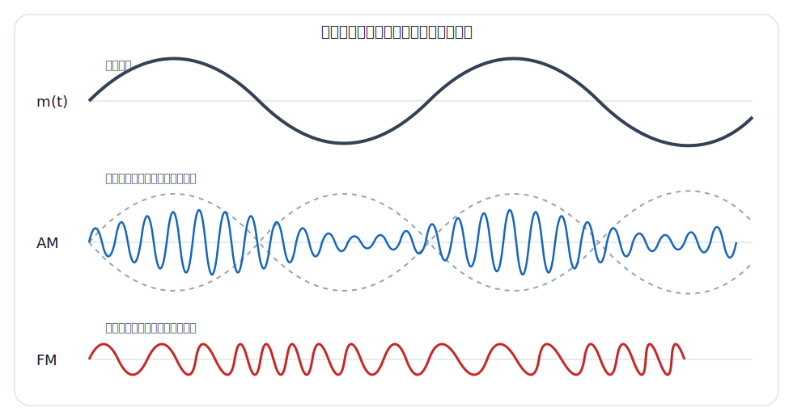
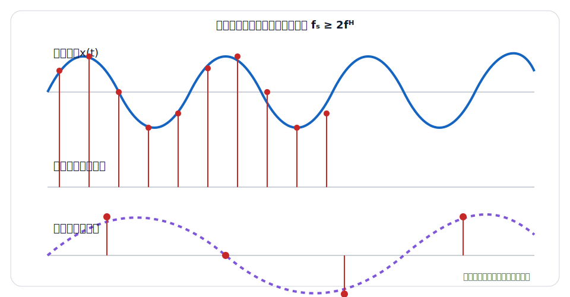

# 📚 通信原理与高频电子线路

使用说明：🔴红色 = 期末必须掌握的系统框图、公式和比较结论；🔵蓝色 = 计算步骤与简答题得分关键词；⚫️黑色 = 适用条件、物理解释和陷阱。本讲义把《通信原理》的信号传输理论与《高频电子线路》的收发电路放在同一系统中理解。

## 零基础预备：先分清六个词

考点0：消息、信息、信号、信道、噪声、系统

⚫️【消息】：人希望传递的内容，例如语音、文字和图像。【信息】：消息中消除不确定性的部分。【信号】：承载消息的物理量，例如随时间变化的电压、光强或电磁波。

⚫️【信道】：信号传播所经过的媒介及相关设备，可为双绞线、光纤、自由空间等。【噪声】：接收端不希望出现的随机扰动。【通信系统】：完成信息产生、变换、传输和恢复的整体。

考点0.1：基带、载波、调制与解调

⚫️【基带信号】：由信源直接产生、频谱通常靠近零频的原始电信号。【载波】：便于远距离传输的高频周期信号。

🔴【调制】：在发送端让载波的幅度、频率或相位随消息变化；【解调】：在接收端从已调信号中恢复基带消息；【混频】：改变信号中心频率，一般保留原调制内容。

考点0.2：最常混淆的单位

🔴【Hz】：每秒周期数或带宽单位；【Baud】：每秒码元数；【bit/s】：每秒信息比特数；【dB】：两个功率或幅度比值的对数表示，不是绝对功率单位。

🔵看到题目先在量旁写单位，再判断它是频率、码元速率、比特率还是信噪比，能避免大多数公式套错。

第一章：通信系统基础

考点1：通信系统模型

🔴【基本模型】：信源 → 发送设备 → 信道 → 接收设备 → 信宿；噪声通常在信道及接收端模型中引入。

🔵【各部分作用】：信源产生消息；发送设备完成编码、调制和放大；信道承载信号；接收设备完成选频、放大、解调和译码；信宿接收消息。

🔴【模拟与数字通信】：模拟通信直接处理连续消息波形；数字通信以离散符号传输信息，通常具有抗干扰、易再生、易加密和便于处理等优点，但需要同步并占用相应系统资源。

考点2：通信方式

🔴【单工】：只能单向通信，如传统广播。

🔴【半双工】：双方都能发送，但同一时刻只能一方发送，如对讲机。

🔴【全双工】：双方可同时发送和接收，如普通电话通话。

⚫️【串行与并行】：串行逐位传输、线路少且适合远距离；并行多位同时传输、近距离速度高但线路多并存在偏斜问题。

考点3：信号、频谱与带宽

🔴【周期与频率】：`f = 1/T`，角频率 `ω = 2πf`；波长 `λ = c/f`，真空中 `c ≈ 3×10⁸ m/s`。

🔴【时域与频域】：时域看波形随时间变化；频域看信号由哪些频率分量组成。调制本质上常表现为频谱搬移或角度变化。

🔴【带宽】：信号带宽描述主要频谱占据范围；信道带宽描述信道可有效传输的频率范围，二者不是同一概念。

第二章：信息量、信道与容量

考点4：信息量与熵

🔴【自信息量】：事件概率为 `p` 时，信息量 `I = -log₂p` bit；越不可能发生的事件，发生后提供的信息量越大。

🔴【离散信源熵】：`H(X) = -Σp(x)log₂p(x)` bit/符号；等概率时熵最大。

考点5：码元速率与信息速率

🔴【码元速率】：每秒传输码元数，单位Baud；【比特率】：每秒传输信息比特数，单位bit/s。

🔴【关系】：若每个码元有 `M` 种等概状态并携带 `log₂M` bit，则 `Rb = Rs log₂M`。

⚫️【坑点】：只有二进制码元且每码元携带1 bit时，码元速率与比特率数值才可能相等。

考点6：奈奎斯特与香农公式

🔴【奈奎斯特无噪声极限】：理想低通信道最高码元速率 `Rs,max = 2B`；M进制最高比特率 `Rb,max = 2B log₂M`。

🔴【香农容量】：高斯白噪声信道 `C = B log₂(1+S/N)` bit/s，`S/N` 必须使用线性功率比。

🔵【dB换算】：若信噪比给成 `x dB`，先用 `S/N = 10^(x/10)` 转为线性值再代入香农公式。

⚫️【理解】：增大带宽或信噪比都能提高容量，但信噪比的收益呈对数增长；香农公式给出理论上限，不保证某种具体调制编码自动达到该速率。

考点7：香农公式例题

🔵【题目】：信道带宽 `B = 3 kHz`，信噪比 `30 dB`，求理论容量。

🔵【解】：线性信噪比 `S/N = 10^(30/10)=1000`；`C = 3000log₂(1001) ≈ 29.9 kbit/s`。

专题1：随机过程与噪声基础

🔴【平稳随机过程】：统计特性不随时间平移而改变；广义平稳通常要求均值为常数、自相关只与时间差有关。

🔴【功率谱密度】：广义平稳随机过程的自相关函数与功率谱密度构成傅里叶变换对。

🔴【白噪声】：理想白噪声功率谱密度在全部频率上为常数；实际系统只在有限带宽内近似为白噪声。

🔴【高斯噪声】：幅度服从高斯分布；“高斯”描述幅度统计，“白”描述频谱，两者不是同义词。

第三章：模拟调制

考点8：为什么要调制

🔴【目的】：把基带信号搬移到适合信道和天线辐射的频段；实现频分复用；改善抗干扰或适配传输特性；减小实际天线尺寸。

🔴【三类连续波调制】：调幅AM改变载波幅度；调频FM改变瞬时频率；调相PM改变瞬时相位。

考点9：普通调幅AM

🔴【单音AM】：`s(t)=Ac[1+m cosωmt]cosωct`，`m` 为调幅度。包络不失真通常要求 `0≤m≤1`；`m>1` 为过调幅。

🔴【频谱】：含载波 `fc` 和上下边带 `fc±fm`；若基带最高频率为 `W`，普通AM带宽 `BAM = 2W`。

🔴【功率效率】：单音、`m=1` 时，普通AM边带功率占总功率最大约1/3，大量功率在不携带消息的载波上。

考点10：DSB-SC与SSB

🔴【DSB-SC】：抑制载波双边带，带宽 `2W`，需相干解调，功率利用率高于普通AM。

🔴【SSB】：只传一个边带，带宽 `W`，节省带宽和功率，但产生和同步解调更复杂。

🔴【包络检波条件】：适用于具有足够载波且不过调的普通AM；DSB-SC不能直接用普通包络检波无失真恢复。

考点11：角度调制

🔴【FM】：消息改变瞬时频率，载波幅度不变，抗幅度噪声能力通常优于AM，但占用带宽可能更大。

🔴【PM】：消息改变瞬时相位；FM与PM都属于角度调制，频谱是非线性变换。

🔴【Carson近似带宽】：单音FM常用 `BFM ≈ 2(Δf+fm)`，其中 `Δf` 为最大频偏。

第四章：采样、量化与基带传输

考点12：采样定理

🔴【低通信号】：最高频率为 `fH` 的带限信号，为避免频谱混叠，应满足 `fs ≥ 2fH`；实际系统通常留有过渡带裕量。

⚫️【坑点】：采样频率等于2倍最高频率是理想边界，工程上还要考虑抗混叠滤波器。

考点13：PCM

🔴【PCM流程】：抽样 → 量化 → 编码；接收端完成译码、低通重建。

🔴【码率】：若采样频率 `fs`、每样值编码 `n` bit，则单路PCM码率 `Rb = nfs`。

🔴【量化噪声】：量化级越多、位数越高，量化误差通常越小，但码率和系统复杂度增加。

🔴【非均匀量化】：电话语音常用压扩改善小信号量化信噪比；我国/欧洲PCM体系常见A律13折线，美国、日本传统体系常见μ律。

⚫️【考试提醒】：若题目要求A律13折线逐次比较编码，需按题目给定的极性码、段落码和段内码规则计算；不同教材位序标法应服从题设。

考点14：数字基带与码间串扰

🔴【码间串扰ISI】：信道带限使相邻码元波形在抽样时刻互相影响，可能造成判决错误。

🔴【无码间串扰思想】：合理设计发送、信道和接收滤波器，使除本码元抽样点外，其他码元在该抽样点贡献为零。

🔴【眼图】：眼睛张开越大，抽样判决裕量通常越大；闭合表示噪声、失真或码间串扰加重。

🔴【升余弦滚降】：滚降系数 `0≤α≤1` 时，无码间串扰系统常用关系 `B = (1+α)Rs/2`，等价于 `Rs,max = 2B/(1+α)`。

⚫️【权衡】：α越大，时域波形衰减更快、定时容差通常更好，但占用带宽更宽。

考点15：常用线路码

🔴【单极性NRZ】：实现简单但直流分量较大、同步信息弱。

🔴【双极性AMI】：1交替用正、负脉冲表示，0为零电平，直流分量较小且可利用极性破坏检测错误。

🔴【曼彻斯特码】：每比特中间必有跳变，自同步能力强，但所需带宽较大。

🔴【HDB3码】：在AMI基础上把连续四个0替换为含破坏脉冲V的特定模式，限制长连零并保留近似无直流特性；V脉冲违反正常AMI极性交替规律。

专题2：误码率与不失真传输

🔴【误码率】：`Pe = 错误比特数/传输总比特数`；误码率是统计指标，不等同于某一小段数据必然出现的错误比例。

🔴【线性系统无失真条件】：系统幅频特性在信号带宽内为常数，相频特性为随频率线性变化；等价于输出只是输入的比例缩放和固定时延。

🔴【中继再生】：数字中继通过判决、整形、定时恢复抑制噪声累积，但每级仍可能产生判决错误。

第五章：数字频带传输

考点16：ASK、FSK与PSK

| 方式 | 被键控参数 | 典型特点 |
|---|---|---|
| ASK | 幅度 | 实现简单，较易受幅度噪声影响 |
| FSK | 频率 | 包络恒定，可非相干检测，带宽通常较大 |
| PSK | 相位 | 功率效率和抗噪性能较好，需要相位参考 |

🔴【BPSK】：两个相位相差π表示0和1；相干检测存在载波相位同步问题。

🔴【DPSK】：用相邻码元相位变化传递信息，缓解绝对相位模糊，但性能通常略逊于相干PSK。

🔴【QPSK】：每码元有4种相位，理想映射每码元携带2 bit，因此相同码元率下比特率是BPSK的2倍。

考点17：差错控制基础

🔴【奇偶校验】：可检出奇数个位错误，不能纠错。

🔴【汉明距离】：码组之间不同位数；若最小距离为 `dmin`，可检测最多 `dmin-1` 位错误，可纠正最多 `floor[(dmin-1)/2]` 位错误。

🔴【ARQ与FEC】：ARQ检测错误后请求重传；FEC加入冗余使接收端直接纠错，适合时延或回传受限场景。

第六章：复用、交换与光纤通信

考点18：复用方式

🔴【FDM】：不同信号占不同频带，同时传输；【TDM】：不同信号占不同时间片；【WDM】：光纤中以不同光波长复用；【CDM/CDMA】：以不同码序列区分用户。

⚫️【OFDM】：把高速数据分配到多个相互正交的子载波，能提高频谱利用率并便于对抗多径，但峰均功率比较高且对频偏敏感。

考点19：光纤原理与窗口

🔴【导光机制】：纤芯折射率略高于包层，满足条件时光在界面发生全反射并沿纤芯传播。

🔴【单模与多模】：单模光纤模间色散小、适合高速长距离；多模光纤芯径较大、耦合容易，常用于较短距离。

🔴【常用窗口】：`1310 nm` 附近标准单模光纤色散较小；`1550 nm` 附近衰减最低，适合长距离并可配合光放大器。

⚫️【坑点】：窗口是波长范围的简称，不是只有一个精确波长；题目只给 `1.31 μm/1.55 μm` 时，应分别联想到低色散/低损耗。

第七章：电磁波与移动通信

考点20：电磁波谱

🔴【频率由低到高】：无线电波 → 微波（常视为无线电波子范围）→ 红外线 → 可见光 → 紫外线 → X射线 → γ射线。

🔴【波长关系】：`c = λf`；频率越高，波长越短，单个光子能量也越高。

⚫️【坑点】：有的简化题只列“无线电、红外、可见、紫外”，顺序仍按频率升高排列；若题目问波长则顺序相反。

考点21：1G至5G

| 代际 | 核心特征 | 常见关键词 |
|---|---|---|
| 1G | 模拟蜂窝语音 | 模拟、语音、FDMA |
| 2G | 数字蜂窝通信 | GSM/CDMA、短信、数字语音 |
| 3G | 移动多媒体数据 | IMT-2000、视频与数据能力增强 |
| 4G | 全IP移动宽带 | LTE、OFDM、高速数据 |
| 5G | 多场景智能连接 | eMBB、URLLC、mMTC、低时延与大连接 |

⚫️【考试口径】：代际是系统能力与标准体系的概括，不宜把单一频段、单一业务或某家公司设备当作定义。

第八章：高频电子线路

考点22：LC选频与品质因数

🔴【谐振频率】：理想LC回路 `f0 = 1/(2π√LC)`；谐振回路用于从许多频率中选择所需频率。

🔴【品质因数Q】：反映储能与损耗关系；一般Q越高，谐振峰越尖、选择性越好、通频带越窄。

考点23：高频小信号与功率放大器

🔴【高频小信号放大器】：主要指标包括增益、通频带、选择性、稳定性和噪声系数，常使用调谐回路作负载。

🔴【丙类谐振功放】：晶体管导通角小于180°，集电极电流脉冲经LC选频网络恢复近似正弦输出；效率高但不适合直接线性放大任意包络信号。

考点24：反馈振荡器

🔴【巴克豪森条件】：稳定振荡时 `|AF|=1` 且总相移为 `2kπ`；起振时环路增益需略大于1。

🔴【类型】：RC振荡器偏低频，LC振荡器偏高频，石英晶体振荡器频率稳定度高。

考点25：混频与超外差接收机

🔴【混频】：把已调信号的载频变换到另一频率，理想情况下保留原调制信息；输出包含和频、差频等分量，再由滤波器选取。

🔴【中频】：常选 `fIF = |fLO - fRF|`。超外差接收机把不同电台频率统一变换为固定中频，便于获得稳定的增益与选择性。

🔵【接收链路】：天线 → 高频放大/选频 → 混频器＋本振 → 中频放大 → 解调 → 低频放大。

考点26：解调与反馈控制

🔴【AM解调】：普通AM可用包络检波；DSB-SC/SSB通常用同步检波。

🔴【FM解调】：称鉴频，把瞬时频率变化恢复为基带信号；PM解调称鉴相。

🔴【锁相环PLL】：主要由鉴相器、环路滤波器和压控振荡器组成，可用于载波同步、频率合成和FM解调。

第九章：系统型综合题

考点27：发射机与接收机

🔵【发射机】：消息 → 变换/编码 → 调制 → 高频功率放大 → 天线。

🔵【接收机】：天线 → 选频与低噪声放大 → 变频/中频放大 → 解调 → 译码/输出。

⚫️【区分】：调制发生在发送端，解调发生在接收端；混频主要改变中心频率，不应丢失原有调制信息。

考点28：带宽与速率综合判断

🔵【标准顺序】：确认题目给的是基带带宽还是信道带宽 → 确认有噪/无噪模型 → dB转线性 → 选奈奎斯特或香农公式 → 写单位与理论上限含义。

⚫️【坑点】：奈奎斯特公式含M进制数，香农公式含S/N；两者约束可能同时存在，实际速率不能超过较严格的上限。

第十章：期末自测与答案

考点29：自测题

1. 对讲机属于单工、半双工还是全双工？
2. `20 dB` 的功率信噪比对应多少线性比值？
3. 基带最高频率为4 kHz，理想最低采样频率是多少？
4. 普通AM在基带带宽为5 kHz时占用多少带宽？
5. DSB-SC能否直接用普通包络检波无失真恢复？
6. QPSK每码元理想携带多少比特？
7. 1310 nm和1550 nm窗口分别突出什么优点？
8. 超外差接收机为什么把不同射频变到固定中频？
9. 电磁波频率由无线电到紫外升高时，波长怎样变化？
10. PLL的三个基本组成是什么？

考点30：自测答案

🔵1. 半双工。2. `100`。3. `8 kHz`。4. `10 kHz`。5. 不能，通常需同步检波。6. 2 bit。7. 1310 nm低色散，1550 nm低损耗。8. 便于固定选频、稳定放大和统一解调。9. 变短。10. 鉴相器、环路滤波器、压控振荡器。

第十一章：复习优先级与取舍

考点31：复习优先级

🔴【A级必会】：系统框图、单双工、码元/比特率、香农、采样、AM/FM/PM、ASK/FSK/PSK、电磁波谱、光纤窗口、1G～5G。

🔵【B级得分】：奈奎斯特、PCM码率、升余弦滚降、AMI/HDB3、AM/DSB/SSB带宽、FM带宽、复用方式、LC谐振、振荡条件、混频与超外差。

⚫️【C级选学】：随机过程完整推导、最佳接收、精确误码率积分、丙类功放动态线和复杂锁相环计算。先掌握概念比较和一步公式题，再进入这些进阶专题。

第十二章：公开试题提炼训练

考点32：网络题型分析

⚫️公开考试大纲和期末试卷样例表明，《通信原理》常把一条完整链路拆成多个计算点：信息量/速率 → 采样与PCM → 基带成形 → 数字调制 → 带宽与误码；《高频电子线路》则更重视谐振、振荡、混频、调制解调和收发机框图。零基础先掌握系统位置，再记公式。

| 题型 | 常见任务 | 易错点 |
|---|---|---|
| 基本概念 | 系统模型、性能指标、单双工 | 把消息、信号、信息混为一谈 |
| 速率容量 | Baud/bit/s、奈奎斯特、香农 | dB未转线性、M进制漏乘log₂M |
| 数字化 | 采样、量化、编码、PCM复用 | 采样率与码率混淆 |
| 基带传输 | 线路码、眼图、升余弦 | 把带宽B和码元率Rs混用 |
| 调制 | AM/FM/PSK带宽和波形 | 调制、混频、解调混淆 |
| 高频电路 | LC、振荡器、超外差 | 本振、射频、中频关系写反 |

考点33：基础层原创练习

1. 对讲机为什么属于半双工，而广播为什么属于单工？

2. 8进制码元速率为 `2400 Baud`，每个码元等概携带信息，求比特率。

3. 功率信噪比为 `15 dB`，换算为线性比值。

4. 最高频率为 `3.4 kHz` 的语音信号，理想最低采样率是多少？若实际采用 `8 kHz`、每个样值8 bit，单路PCM码率是多少？

5. 基带最高频率为 `5 kHz`，普通AM、DSB-SC和SSB各占多少带宽？

6. QPSK比特率为 `2 Mbit/s`，理想码元速率是多少？

考点34：基础层答案

🔵1. 对讲机双方都能发送但不能同时发送，属于半双工；广播只有发射台向听众单向传输，属于单工。

🔵2. `Rb=Rslog₂M=2400×log₂8=7200 bit/s`。

🔵3. `S/N=10^(15/10)≈31.6`。功率比使用 `10lg`，不是 `20lg`。

🔵4. 理想边界 `fs≥2fH=6.8 kHz`；实际PCM码率 `Rb=8k×8=64 kbit/s`。

🔵5. 普通AM与DSB-SC均为 `2W=10 kHz`；SSB只占一个边带，为 `W=5 kHz`。

🔵6. QPSK每码元2 bit，`Rs=2 Mbit/s÷2=1 MBaud`。

考点35：计算层原创练习

1. AWGN信道带宽 `4 kHz`、信噪比 `15 dB`，求香农容量。

2. M进制无噪理想低通信道带宽 `3 kHz`，采用8进制码元，按奈奎斯特公式求最高比特率。

3. 升余弦系统码元速率 `8 kBaud`、滚降系数 `α=0.25`，求最小单边低通等效带宽。

4. 单音FM最大频偏 `75 kHz`、最高调制频率 `15 kHz`，用Carson公式估算带宽。

5. 超外差接收机接收 `100 MHz` 信号，本振为 `110.7 MHz`，求中频。

6. 理想LC振荡回路 `L=10 μH、C=100 pF`，估算谐振频率。

考点36：计算层详细解析

🔵1. 先转线性 `S/N=31.6`；`C=4000log₂(1+31.6)≈4000×5.03≈20.1 kbit/s`。结果是理论上限。

🔵2. `Rb,max=2B log₂M=2×3000×3=18 kbit/s`。

🔵3. `B=(1+α)Rs/2=1.25×8000/2=5 kHz`。若直接写8 kHz，说明把码元率当成带宽。

🔵4. `BFM≈2(Δf+fm)=2×(75+15)=180 kHz`。

🔵5. `fIF=|fLO-fRF|=|110.7-100|=10.7 MHz`。

🔵6. `f0=1/(2π√LC)`；`LC=10×10⁻⁶×100×10⁻¹²=10⁻¹⁵`，所以 `f0≈1/(2π×3.162×10⁻⁸)≈5.03 MHz`。

考点37：综合分析练习

1. 某数字语音链路采用 `8 kHz` 采样、每样值8 bit，随后用QPSK传输。忽略信道编码，求单路比特率和QPSK码元率；若成形滚降系数0.5，求低通等效带宽。

2. 一个码的最小汉明距离为4，最多能检测几位错误？最多能纠正几位错误？能否保证同时纠正2位错误？

3. 普通AM信号调幅度 `m=1.2`，使用包络检波会发生什么问题？如何改善？

4. 说明接收机中“高频选频—混频—中频放大—解调”四个环节分别做什么。

考点38：综合题答案

🔵1. PCM比特率 `Rb=8k×8=64 kbit/s`；QPSK码元率 `Rs=64k/2=32 kBaud`；`B=(1+0.5)×32k/2=24 kHz`。

🔵2. 可检测最多 `dmin-1=3` 位错误；可纠正最多 `floor[(4-1)/2]=1` 位错误；不能保证纠正2位错误。

🔵3. `m>1` 发生过调幅，包络与原消息不再一一对应，包络检波产生失真。可减小调制信号幅度/调幅度，或采用能够正确同步恢复的其他调制解调方案。

🔵4. 高频选频选择目标台并抑制带外干扰；混频把目标射频搬到固定中频；中频放大提供主要增益和选择性；解调从已调信号恢复基带消息。

考点39：进阶题的取舍

⚫️公开通信专业试卷还常考A律13折线逐次比较编码、HDB3编译码、匹配滤波器、循环码矩阵和具体误码率。这些属于完整通信专业期末的重要内容，零基础学习成本较高。若课程范围明确包含，应在A级内容掌握后单独做专题训练，不能只背一句定义。

第十三章：公开课程与扩展依据

考点40：课程框架来源

⚫️【国家精品在线开放课程《通信原理》】：https://www.icourse163.org/course/detail.htm?cid=316006

⚫️【东南大学《通信原理》】：https://www.icourse163.org/course/SEU-1001752356

⚫️【国家级一流课程《高频电子线路》】：https://www.icourse163.org/course/detail.htm?cid=1003428003

⚫️【NASA电磁波谱教学资源】：https://science.nasa.gov/learn/basics-of-space-flight/chapter6-2/

⚫️【英国开放大学光纤衰减教学】：https://www.open.edu/openlearn/digital-computing/digital-communications/content-section-2.3

⚫️【ITU移动通信代际术语】：https://www.itu.int/ITU-D/tech/MobileCommunications/IMT_INTRODUCING/IMT_Introducing.html

⚫️【重庆邮电大学《通信原理C》考试大纲】：https://scie.cqupt.edu.cn/__local/C/C8/D0/FE064DDCA4225A1B8F69D6F9BFE_AAA435D8_2AC54.pdf

⚫️【青岛科技大学公开通信原理试卷样例】：https://xk.qust.edu.cn/__local/3/68/37/1AAC303D0EAA89C7A1436849252_E4FDA68C_216AF.pdf
